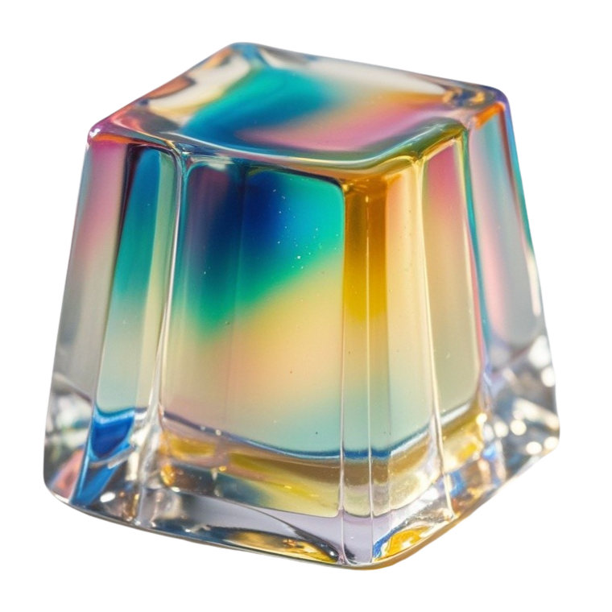
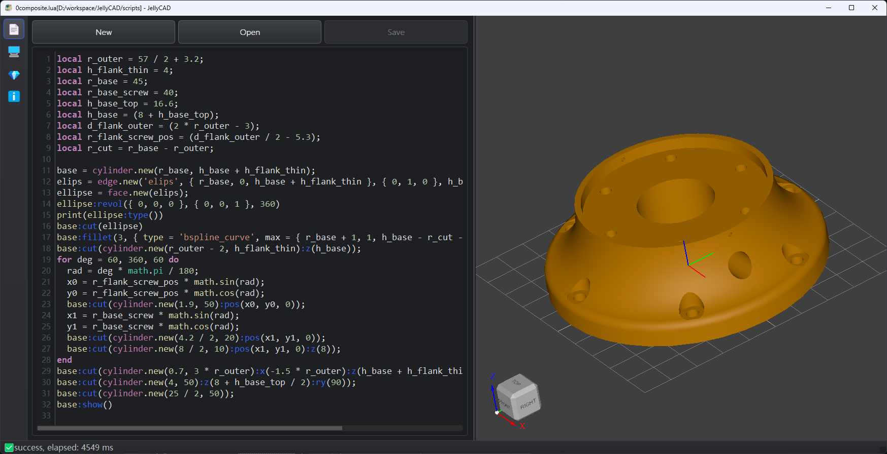
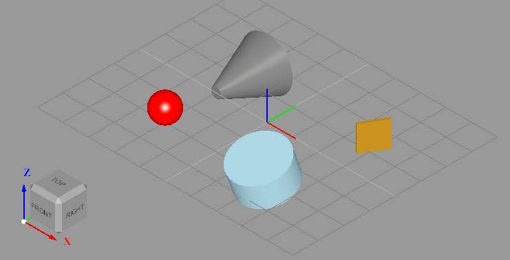
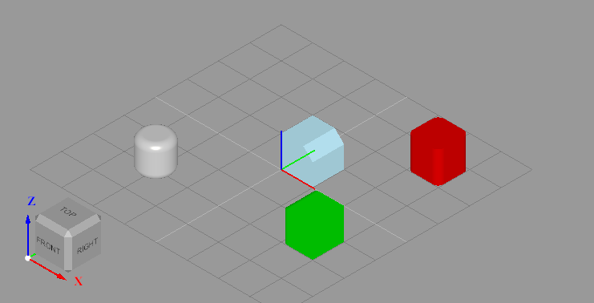
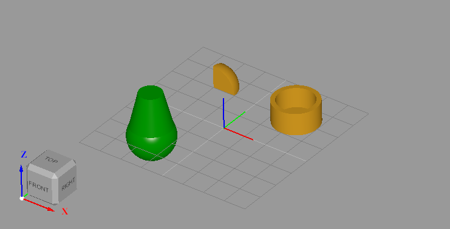

<div align="center">
  
  <p></p>
  <p><strong>JellyCAD</strong>开源可编程CAD软件</p>
</div>
通过脚本语言编程，构造和导出3D模型。



## 特点

- 跨平台，支持`Windows`,`Linux`和`Macos`系统
- 通过`lua`脚本语言构造三维模型
- 可导出`STL`,`STEP`,`IGES`格式的文件

## 开发环境

- Windows 11 23H2
    - CMake 3.24.0-rc1
    - Visual Studio 17 2022
    - vcpkg(2025.06.13)
      - qt5-base 5.15.16
      - opencascade 7.9.0
      - sol2 3.5.0
      - lua 5.4

- Ubuntu 22.04.5 LTS(WSL)
    - CMake 3.31.0
    - c++ (Ubuntu 11.4.0-1ubuntu1~22.04)
    - vcpkg(2025.06.13)

- macOS 15.5
    - vcpkg(2025.06.13)

## 编译

依赖包安装

```bash
vcpkg install qt5-base lua sol2 opencascade
```

生成程序

```bash
git clone https://github.com/Jelatine/JellyCAD.git
cd JellyCAD
mkdir build
cd build
cmake .. -DCMAKE_TOOLCHAIN_FILE=(your_vcpkg_dir)/scripts/buildsystems/vcpkg.cmake
cmake --build .
```

解决Ubuntu24的Emoji问题:`sudo apt install fonts-noto-color-emoji`

## 使用

### 命令行模式

```bash
./JellyCAD -f file.lua
```

### 图形界面模式

#### 鼠标控制3D界面

- 鼠标左键平移
- 鼠标右键旋转
- 鼠标滚轮缩放

#### 快捷键

- 新建:Ctrl+N
- 打开:Ctrl+O
- 保存:Ctrl+S

### 脚本编写

[帮助文档](resource/help.md)

[Lua 5.4 Reference Manual - contents](https://www.lua.org/manual/5.4/)

[Lua 教程 | 菜鸟教程](https://www.runoob.com/lua/lua-tutorial.html)

## 软件定义的类型和函数

### 全局函数

`show`在3D界面显示单个或多个模型，`export_stl`/`export_step`/`export_iges`分别导出对应格式的文件

### 形状实现类

以下8个形状均继承`shape`基类

- `box`/`cylinder`/`cone`/`sphere`创建类型`SOLID`的三维模型
- `edge`创建边缘，支持`lin`(line),圆弧`circ`(circle),`elips`(ellipse),`hypr`(hyperbola),`parab`(parabola)类型的边缘
- `wire`创建线，`polygon`创建多边形的线
- `face`创建面

### 形状基类

基类`shape`实现的方法：

构造函数可导入`step`和`stl`文件，如`s=shape.new('flank.stl');`

- `type`返回形状类型，格式为字符串
- `fuse`融合
- `cut`剪切
- `common`共有部分
- `fillet`圆角
- `chamfer`倒角
- `translate`相对平移
- `rotate`相对旋转
- `locate`位置和姿态定位
- `color`设置颜色
- `transparency`设置透明度
- `prism`拉伸操作
    - 拉伸形状变换：`edge->face,face->solid,wire->shell`

## 例程

例1：绘制实体，设置位姿和颜色

```lua
print("Hello, World!");
b = box.new(0.1, 1, 1); -- create a box with dimensions 0.1 x 1 x 1
b:translate(2, 2, 0); -- translate the box by 2 units in the x, y
b:rotate(0, 0, -30); -- rotate the box by -30 degrees around the z axis
-- create a cylinder with radius 1, height 1, color lightblue, position {2, -2, 0}, rotate 20 degrees around the x axis
c = cylinder.new(1, 1, { color = "lightblue", pos = { 2, -2, 0 }, rx = 20 });
-- create a cone with radius 1, height 0.2, color gray, position {-2, 2, 0}, roll 90 degrees(RPY)
n = cone.new(1, 0.2, 2, { color = "#808080", pos = { -2, 2, 0 }, rot = { 90, 0, 0 } });
s = sphere.new(0.5); -- create a sphere with radius 0.5
s:locate({pos = { -2, -2, 0.5 }, rot = { 0, 0, 0 }}); -- set the position and rotation of the sphere
s:color("red"); -- set the color of the sphere to red
show({b,c,n,s});  -- display the objects
```



例2：圆角和倒角

```lua
print("Fillet OR Chamfer");
b1=box.new(1,1,1,{color='red3',x=2,y=2});
b1:fillet(0.2,{dir='z'}); -- 圆角 r=0.2 限制条件为边缘与基坐标系的Z重合
b2=box.new(1,1,1,{color='green3',x=2,y=-2});
b2:fillet(0.2,{max={3,3,3}}); -- 圆角 r=0.2 边缘始末点同时小于 3,3,3
c=cylinder.new(0.5,1,{color='gray',x=-2,y=-2});
c:fillet(0.2,{type='circle'}); -- 圆角 r=0.2 限制条件为边缘类型是圆形
b3=box.new(1,1,1,{color='lightblue'});
b3:chamfer(0.3,{min={0.5,-1,0.5},max={9,9,9}}); -- 倒角 r=0.3 边缘始末点同时大于 0.5,-1,0.5 且小于 9,9,9
show({b1,b2,b3,c});
```



例3：拉伸多边形

```lua
print('Polygon Prism')
points={{0,0,0},{0,1,0},{0.5,1,0},{0.5,1.5,0},{1.5,1.5,0},{1.5,1,0},{2,1,0},{2,0,0}};
p = polygon.new(points);
p:color("#FFF")
show(p);
f = face.new(p);
f:prism(0, 0, 1);
show(f);
```

例4：布尔操作

```lua
print("Boolean Operation");
c=cylinder.new(10,10);
c:cut(cylinder.new(8,10,{pos={0,0,1}}));
c:translate(20,20,0);
show(c);
s=sphere.new(10);
b=box.new(10,10,10);
s:common(b);
s:translate(-20,20,0);
show(s);
c1=cone.new(10,5,20,{color='green4'});
s1=sphere.new(10,{color='red'});
c1:fuse(s1);
c1:translate(-20,-20,0);
show(c1);
```



例5：导出文件

```lua
print("Export");
c=cylinder.new(10,10);
s=sphere.new(10);
c=cone.new(10,5,20,{color='green4'});
export_stl(c,'cylinder.stl',{type='ascii',radius=0.05});
export_step(s,'sphere.step');
export_iges(c,'cone.iges');
```

## 参考

> [JellyCAD old version](https://github.com/Jelatine/JellyCAD/tree/master)
>
> [OpenCascade 说明文档](https://dev.opencascade.org/doc/overview/html/index.html)
>
> [布尔运算](https://blog.csdn.net/weixin_45751713/article/details/139399875)
>
> [圆角倒角](https://blog.csdn.net/fcqwin/article/details/17204707)
>
> [平移旋转](https://blog.csdn.net/cfyouling/article/details/136400406)
>
> [访问拓扑边TopoDS_Edge的起末点](https://blog.csdn.net/s634772208/article/details/130101544)
>
> [判断Edge/Wire是直线还是圆弧(wire:BRepAdaptor_CompCurve,Edge:BRepAdaptor_Curve)](https://www.cnblogs.com/occi/p/14619592.html)
>
> [创建实体](https://developer.aliyun.com/article/235775)
>
> [fougue/mayo: 3D CAD viewer and converter based on Qt + OpenCascade](https://github.com/fougue/mayo)

