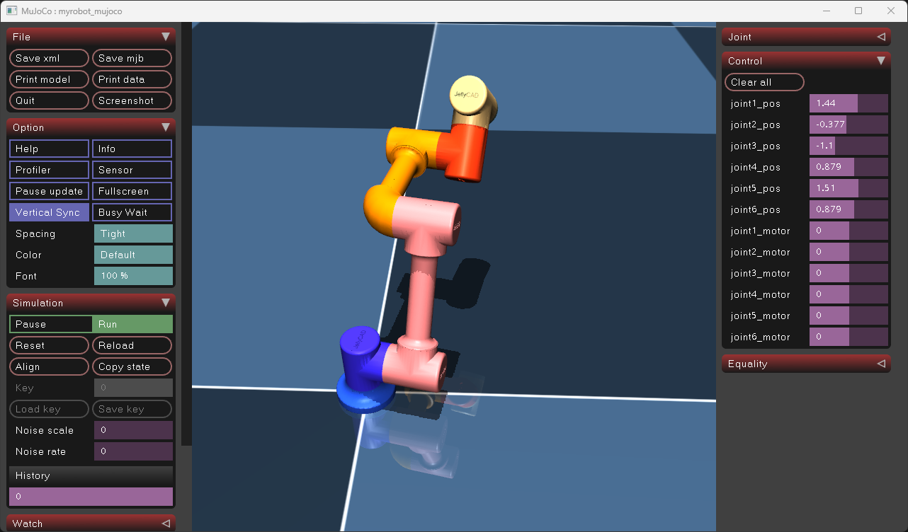

<div align="center">
  

  # JellyCAD

  **开源可编程 CAD 软件**

  现代开源可编程 CAD 软件专为程序员、机器人开发者和参数化建模爱好者设计

  

  [](LICENSE)
  [](https://github.com/Jelatine/JellyCAD)

  **[官方主页](https://jelatine.github.io/JellyCAD/)**

</div>

## ✨ 特点

- 🌐 **跨平台支持** - 兼容 Windows、Linux 和 macOS 系统
- 📝 **Lua 脚本编程** - 使用简洁的 Lua 语言构造三维模型
- 🤖 **机器人开发** - 支持导出URDF和MJCF，方便ROS/ROS2和mujoco开发
- 💾 **多格式导出** - 支持导出 STL、STEP、IGES 格式文件
- 🎨 **可视化编辑** - 提供图形界面和命令行两种使用模式
- 🔧 **丰富的操作** - 支持布尔运算、圆角、倒角、拉伸等多种建模操作
- 💬 **AI 辅助编程** - 集成大模型对话功能，智能生成和修改 Lua 脚本
- 🔀 **Git 版本管理** - 内置完整的 Git 功能，支持提交、分支、远程仓库管理

## 🤖 机器人应用

JellyCAD 专为机器人开发者设计，提供完整的机器人建模与仿真工作流：

### 支持的机器人格式

- **URDF (Unified Robot Description Format)** - 兼容 ROS1 和 ROS2，支持完整的连杆、关节、惯性参数定义
- **MJCF (MuJoCo XML Format)** - 支持 MuJoCo 物理仿真引擎的模型格式

### 典型应用场景

- 📐 **机械臂建模** - 使用 Lua 脚本快速构建多自由度机械臂模型
- 🔗 **运动学链设计** - 通过 DH 参数（MDH/SDH）精确定义关节位姿关系
- ⚙️ **参数化建模** - 利用编程方式批量生成不同配置的机器人模型
- 🎮 **仿真集成** - 无缝对接 RViz、Gazebo、MuJoCo 等主流仿真平台
- 🔄 **快速迭代** - 代码化建模方式便于版本控制和设计优化

**Lua 脚本建模示例**


### 核心优势

相比传统 CAD 软件手动建模后再转换为 URDF，JellyCAD 提供：

✅ 一键导出完整的 ROS 功能包结构
✅ 自动计算惯性张量和质心位置
✅ 支持复杂装配体的层级关系
✅ 代码化建模便于参数化和批量生成

**ROS2 + RViz 可视化**


**MuJoCo 物理仿真**



> 详见示例 6 了解如何使用 JellyCAD 构建 6 自由度机械臂并导出 URDF。

## 🛠️ 开发环境

### 核心依赖

- **CMake** >= 3.24.0
- **C++ 编译器** (支持 C++17 或更高版本)
- **vcpkg** (2025.06.13 或更新版本)

### 第三方库

- Qt5-base 5.15.16
- OpenCASCADE 7.9.0
- Sol2 3.5.0
- Lua 5.4

### 测试平台

- ✅ Windows 11 23H2 + Visual Studio 2022
- ✅ Ubuntu 22.04.5 LTS + GCC 11.4.0
- ✅ macOS 15.5

## 🚀 快速开始

> 📖 完整安装指南请参考：[安装教程](https://jelatine.github.io/JellyCAD/guide/install.html)

### 安装依赖

使用 vcpkg 安装所需的第三方库：

```bash
vcpkg install qt5-base lua sol2 opencascade
```

### 编译项目

```bash
# 克隆仓库
git clone https://github.com/Jelatine/JellyCAD.git
cd JellyCAD

# 创建构建目录
mkdir build
cd build

# 配置 CMake（替换 your_vcpkg_dir 为实际路径）
cmake .. -DCMAKE_TOOLCHAIN_FILE=(your_vcpkg_dir)/scripts/buildsystems/vcpkg.cmake

# 构建项目
cmake --build .
```

### 常见问题

**Ubuntu 24 Emoji 显示问题**

```bash
sudo apt install fonts-noto-color-emoji
```

## 📖 使用指南

### 命令行模式

运行 Lua 脚本文件：

```bash
./JellyCAD -f file.lua
```

执行 Lua 脚本字符串：

```bash
./JellyCAD -c "print('Hello, World!')"
./JellyCAD -c "box.new():export_stl('box.stl')"
```

### 图形界面模式

#### 🖱️ 鼠标操作

| 操作 | 功能 |
|------|------|
| 左键拖拽 | 平移视图 |
| 右键拖拽 | 旋转视图 |
| 滚轮 | 缩放视图 |

#### ⌨️ 快捷键

| 快捷键 | 功能 |
|--------|------|
| `Ctrl+N` | 新建文件 |
| `Ctrl+O` | 打开文件 |
| `Ctrl+S` | 保存文件 |
| `Ctrl+F` | 编辑器搜索 |
| `Ctrl+/` | 注释/取消注释 |

#### 💬 AI 辅助编程

JellyCAD 集成了大模型对话功能，帮助您更高效地编写 Lua 脚本：

**使用方法：**

1. 点击编辑器工具栏的 **💬 按钮**，打开 LLM 对话窗口
2. 在设置中配置：
   - 选择 AI 服务提供商（OpenAI、Claude、DeepSeek、ModelScope、Aliyun 或自定义）
   - 输入 API Key
   - 选择模型
3. 输入您的需求（如"创建一个边长为 10 的立方体"）
4. 按 `Ctrl+Enter` 发送，AI 将生成相应的 Lua 代码
5. 生成的代码会自动插入到编辑器中

**功能特点：**
- ✅ 支持多家主流 AI 服务商
- ✅ 代码流式生成，实时反馈
- ✅ 智能理解 JellyCAD API
- ✅ 支持代码修改和优化
- ✅ 自动保存配置信息

### 📚 学习资源

- [JellyCAD 帮助文档](https://jelatine.github.io/JellyCAD/guide/install.html)
- [Lua 5.4 官方手册](https://www.lua.org/manual/5.4/)
- [Lua 菜鸟教程](https://www.runoob.com/lua/lua-tutorial.html)

## 🔨 API 参考

### 全局函数

| 函数 | 功能 |
|------|------|
| `show(shape)` | 在 3D 界面显示单个或多个模型 |

### 基础形状类

所有形状类均继承自 `shape` 基类：

#### 实体类型（SOLID）

- 🎲 `box.new(width, height, depth)` - 长方体
- 🪵 `cylinder.new(radius, height)` - 圆柱体
- 🏔️ `cone.new(radius1, radius2, height)` - 圆锥体
- 🏀 `sphere.new(radius)` - 球体
- 🍩 `torus.new(majorRadius, minorRadius)` - 圆环体
- 🧀 `wedge.new(dx, dy, dz, ltx)` - 楔形体

#### 几何元素类型

- 📍 `vertex` - 顶点
- ➖ `edge` - 边缘（子类型： `line`、`circle`、`ellipse`、`hyperbola`、`parabola`、`bezier` 、`bspline` ）
- 🛑`wire` - 线（子类型：`polygon`）
- 🟪 `face` - 面（子类型：`plane`、`cylindrical`、`conical`）
- 🔠 `text` - 文本

### Shape 基类方法

#### 文件导入

```lua
s = shape.new('model.stl')  -- 导入 STL 或 STEP 文件
```

#### 属性和查询

| 方法 | 功能 |
|------|------|
| `copy()` | 返回形状的副本 |
| `type()` | 返回形状类型字符串 |
| `color(color)` | 设置颜色 |
| `transparency(value)` | 设置透明度 |

#### 布尔运算

| 方法 | 功能 |
|------|------|
| `fuse(shape)` | 融合操作（并集） |
| `cut(shape)` | 剪切操作（差集） |
| `common(shape)` | 相交操作（交集） |

#### 修饰操作

| 方法 | 功能 |
|------|------|
| `fillet(radius, options)` | 圆角 |
| `chamfer(distance, options)` | 倒角 |

#### 变换操作

| 方法 | 功能 |
|------|------|
| `pos(x, y, z)` | 绝对位置 |
| `x(val)/y(val)/z(val)/rx(val)/ry(val)/rz(val)` | 绝对位置/姿态 |
| `rot(rx, ry, rz)` | 绝对姿态 |
| `move(move_type, x, y, z)` | 相对平移和旋转，`move_type` 为 `'pos'` 或 `'rot'` |
| `prism(dx, dy, dz)` | 拉伸操作（`edge→face`、`face→solid`、`wire→shell`） |
| `revol(pos, dir, angle)` | 旋转体生成操作 |
| `scale(factor)` | 按比例缩放 |

#### 导出操作

| 方法 | 功能 |
|------|------|
| `export_stl(filename, options)` | 导出 STL 格式文件 |
| `export_step(filename)` | 导出 STEP 格式文件 |
| `export_iges(filename)` | 导出 IGES 格式文件 |

#### 机器人导出(URDF/Mujoco)

- 📐 `axes.new(pose, length)` - 坐标系（用于定义关节位姿）
- 🦴 `link.new(name, shape)` - 机器人连杆
- 🔗 `joint.new(name, axes, type, limits)` - 机器人关节

| 方法 | 功能 |
|------|------|
| `axes:copy()` | 返回坐标系副本 |
| `axes:move(x, y, z, rx, ry, rz)` | 沿自身坐标系进行平移及RPY姿态变换 |
| `axes:mdh(alpha, a, d, theta)` | 沿自身坐标系进行 MDH 位姿变换 |
| `axes:sdh(alpha, a, d, theta)` | 沿自身坐标系进行 SDH 位姿变换 |
| `joint:next(link)` | 设置下一个连杆, 返回连杆对象 |
| `link:add(joint)` | 添加关节, 返回关节对象 |
| `link:export(options)` | 导出 URDF/Mujoco 格式文件 |

> 详细的 API 参考请参考 [JellyCAD 帮助文档](https://jelatine.github.io/JellyCAD/guide/functions.html)。

## 💡 示例代码

### 示例 1：基础实体与变换

```lua
print("Hello, World!");
b = box.new(0.1, 1, 1); -- create a box with dimensions 0.1 x 1 x 1
b:pos(2, 2, 0); -- translate the box by 2 units in the x, y
b:rot(0, 0, -30); -- rotate the box by -30 degrees around the z axis
-- create a cylinder with radius 1, height 1, color lightblue, position {2, -2, 0}, rotate 20 degrees around the x axis
c = cylinder.new(1, 1):color("lightblue"):rx(20):pos(2, -2, 0);
-- create a cone with radius 1, height 0.2, color gray, position {-2, 2, 0}, roll 90 degrees(RPY)
n = cone.new(1, 0.2, 2):color("#808080"):rot(90, 0, 0):pos(-2, 2, 0);
s = sphere.new(0.5); -- create a sphere with radius 0.5
s:pos(-2, -2, 0.5):rot(0, 0, 0); -- set the position and rotation of the sphere
s:color("red"); -- set the color of the sphere to red
show({b,c,n,s});  -- display the objects
```


### 示例 2：圆角和倒角

```lua
print("Fillet OR Chamfer");
b1 = box.new(1, 1, 1):color('red3'):pos(2, 2, 0);
b1:fillet(0.2, { type = 'line', first = { 2, 2, 1 }, last = { 3, 2, 1 }, tol = 1e-4 }); -- 圆角 r=0.2 指定边缘始末点，容差1e-4
b2 = box.new(1, 1, 1):color('green3'):pos(2, -2, 0);
b2:fillet(0.2, { max = { 3, 3, 3 } }); -- 圆角 r=0.2 边缘始末点同时小于 3,3,3
c = cylinder.new(0.5, 1):color('gray'):pos(-2, -2, 0);
c:fillet(0.2, { type = 'circle' }); -- 圆角 r=0.2 限制条件为边缘类型是圆形
b3 = box.new(1, 1, 1):color('lightblue');
b3:chamfer(0.3, { min = { 0.5, -1, 0.5 }, max = { 9, 9, 9 } }); -- 倒角 r=0.3 边缘始末点同时大于 0.5,-1,0.5 且小于 9,9,9
show({ b1, b2, b3, c });
```


### 示例 3：拉伸多边形

```lua
print('Polygon Prism')
points={{0,0,0},{0,1,0},{0.5,1,0},{0.5,1.5,0},{1.5,1.5,0},{1.5,1,0},{2,1,0},{2,0,0}};
p = polygon.new(points);
p:color("#FFF")
show(p);
f = face.new(p);
f:prism(0, 0, 1);
show(f);
```

### 示例 4：布尔操作

```lua
print("Boolean Operation");
c=cylinder.new(10,10);
c:cut(cylinder.new(8,10):pos(0,0,1));
c:move('pos',20,20,0);
show(c);
s=sphere.new(10);
b=box.new(10,10,10);
s:common(b);
s:move('pos',-20,20,0);
show(s);
c1=cone.new(10,5,20):color('green4');
s1=sphere.new(10);
c1:fuse(s1);
c1:move('pos',-20,-20,0);
show(c1);
```


### 示例 5：导出文件

```lua
print("Export");
cylinder.new(10, 10):export_stl('cylinder.stl', { type = 'ascii', radian = 0.05 })
sphere.new(10):export_step('sphere.step');
cone.new(10, 5, 20):color('green4'):export_iges('cone.iges')
```

### 示例 6：URDF 机器人导出

```lua
-- 6自由度机械臂URDF建模及URDF导出示例
-- 通用
local r_shell = 32;
local h_motor = 90;
local offset = h_motor / 2 - r_shell
shell = cylinder.new(r_shell, h_motor)
shell:fillet(5, { type = 'circle', min = { r_shell - 1e-2, -1e-2, h_motor - 1e-2 } });
shell:fuse(cylinder.new(r_shell, h_motor / 2):z(h_motor / 2):rx(90));
shell:cut(cylinder.new(r_shell - 8, h_motor - 1):z(2));
-- 电机
motor = cylinder.new(r_shell - 9, h_motor / 3):color('black')
-- shell:cut(text.new('JellyCAD', 10):pos(-r_shell + 10, -4, h_motor + 1):prism(0, 0, -4)) -- 关节盖刻字(操作很耗时)
-- 生成连接柱
function get_pole(r_outer, r2, h)
    local r1 = r_outer - 1
    local h_stair = 2
    local h_cylinder = r1 - r2 + h_stair
    local stair = cylinder.new(r1, h_cylinder):cut(torus.new(r1, r1 - r2):pos(0, 0, h_cylinder))
    stair:fillet(1, { type = 'circle', min = { r1 - 1e-2, -1e-2, h_stair - 1e-2 } });
    local stair_top = stair:copy():rx(180):z(h)
    local pole = cylinder.new(r2, h):fuse(stair):fuse(stair_top)
    return pole
end

-- 基座
local r_base = 50;
local h_base = 35;
base_link = cylinder.new(r_base, h_base);
local R1 = r_base - r_shell
local R0 = R1 + 2
elips = edge.new('elips', { R1 + r_shell, 0, h_base }, { 0, 1, 0 }, R0, R1);
ellipse = face.new(elips);
ellipse:revol({ 0, 0, 0 }, { 0, 0, 1 }, 360)
base_link:cut(ellipse);
base_link:fillet(3, { type = 'bspline_curve', min = { r_base - 1e-2, -1e-2, (h_base - R0) - 1e-2 } });
-- 肩部
sholder = {}
sholder[1] = shell:copy():z(h_base);
-- 上臂
local h_upperarm = 150
local r_upperarm = 20
local z_upperarm = h_base + h_motor / 2
upperarm = {}
upperarm[1] = shell:copy():rot(90, 180, 0)
upperarm[2] = get_pole(r_shell, r_upperarm, h_upperarm):pos(0, -h_motor / 2, h_motor / 2)
upperarm[3] = shell:copy():rot(90, 0, 0):pos(0, 0, h_motor + h_upperarm)
upperarm[1]:move('pos', 0, -h_motor / 2, z_upperarm)
upperarm[2]:move('pos', 0, -h_motor / 2, z_upperarm)
upperarm[3]:move('pos', 0, -h_motor / 2, z_upperarm)
-- 前臂
local h_forearm = 120
local r_forearm = 20
local z_forearm = h_base + h_upperarm + r_shell + h_motor + offset
forearm = {}
forearm[1] = face.new(edge.new('circ', { 0, 0, 0 }, { 0, 0, 1 }, r_shell)):revol({ 0, -r_shell, 0 }, { 1, 0, 0 }, -90)
forearm[2] = get_pole(r_shell, r_forearm, h_forearm)
forearm[3] = shell:copy():rot(90, 0, 180):pos(0, -h_motor / 2, h_motor / 2 + h_forearm)
forearm[1]:move('pos', 0, -offset, z_forearm + r_shell)
forearm[2]:move('pos', 0, -offset, z_forearm + r_shell)
forearm[3]:move('pos', 0, -offset, z_forearm + r_shell)
-- 手腕1
wrist1 = {}
wrist1[1] = shell:copy():rot(180, 0, 0):pos(0, -h_motor - offset, z_forearm + h_forearm + h_motor + r_shell)
-- 手腕2
wrist2 = {}
local z_wrist2 = z_forearm + h_forearm + 2 * h_motor - offset
wrist2[1] = shell:copy():rot(90, 0, 180):pos(0, r_shell - 2 * h_motor, z_wrist2)
-- 手腕3
local h_flank = 10
wrist3 = cylinder.new(r_shell, h_flank):rot(90, 0, 0):pos(0, r_shell - 2 * h_motor, z_wrist2)
-- 毫米单位转为米，生成URDF
base_link:scale(1e-3):color('#6495ED'):mass(0.1)
sholder[1]:scale(1e-3):color('#8470FF'):mass(0.1)                                  -- 肩部模组外壳
sholder[2] = motor:copy():locate(sholder[1]):move('z', 2):scale(1e-3):mass(0.3)    -- J1电机
upperarm[1]:scale(1e-3):color('#FFC1C1'):mass(0.1)                                 -- 关节2模组外壳
upperarm[4] = motor:copy():locate(upperarm[1]):move('y', -2):scale(1e-3):mass(0.3) -- J2电机
upperarm[2]:scale(1e-3):color('#FFC1C1'):mass(0.2)                                 -- 关节2与关节3之间的连接柱
upperarm[3]:scale(1e-3):color('#FFC1C1'):mass(0.1)                                 -- 关节3模组外壳
upperarm[5] = motor:copy():locate(upperarm[3]):move('y', -2):scale(1e-3):mass(0.3) -- J3电机
forearm[1]:scale(1e-3):color('#FFC100'):mass(0.2)                                  -- 关节3与前臂柱转接器
forearm[2]:scale(1e-3):color('#FFC100'):mass(0.1)                                  -- 前臂柱
forearm[3]:scale(1e-3):color('#FFC100'):mass(0.1)                                  -- 关节4模组外壳
forearm[4] = motor:copy():locate(forearm[3]):move('y', 2):scale(1e-3):mass(0.3)    -- J4电机
wrist1[1]:scale(1e-3):color('#FF8247'):mass(0.1)                                   -- 手腕1模组外壳
wrist1[2] = motor:copy():locate(wrist1[1]):move('z', -2):scale(1e-3):mass(0.3)     -- J5电机
wrist2[1]:scale(1e-3):color('#FFE7BA'):mass(0.1)                                   -- 手腕2模组外壳
wrist2[2] = motor:copy():locate(wrist2[1]):move('y', 2):scale(1e-3):mass(0.3)      -- J16电机
wrist3:scale(1e-3):color('#C1CDC1'):mass(0.1)                                      -- 末端法兰
local d1 = z_upperarm * 1e-3
local a2 = (h_upperarm + h_motor) * 1e-3
local a3 = (h_forearm + h_motor / 2 + r_shell) * 1e-3
local d4 = (h_motor + offset) * 1e-3
local d5 = h_motor * 1e-3
local d6 = (h_motor / 2 + h_flank) * 1e-3
joint_axes1 = axes.new({ 0, 0, d1, 0, 0, 0 }, 0.1)
joint_axes2 = joint_axes1:copy():move({ 0, 0, 0, 90, 0, 0 })
joint_axes3 = joint_axes2:copy():move({ 0, a2, 0, 0, 0, 0 })
joint_axes4 = joint_axes3:copy():move({ 0, a3, 0, 0, 0, 0 })
joint_axes5 = joint_axes4:copy():move({ 0, 0, d4, -90, 0, 0 })
joint_axes6 = joint_axes5:copy():move({ 0, 0, d5, 90, 0, 0 })
joint_tool = joint_axes6:copy():move({ 0, 0, d6, 0, 0, 0 })
j1_limit = { lower = -6.28, upper = 6.28, velocity = 3.14, effort = 9 }
j2_limit = { lower = -6.28, upper = 6.28, velocity = 3.14, effort = 9 }
j3_limit = { lower = -3.14, upper = 3.14, velocity = 3.14, effort = 9 }
j4_limit = { lower = -6.28, upper = 6.28, velocity = 3.14, effort = 3 }
j5_limit = { lower = -6.28, upper = 6.28, velocity = 3.14, effort = 3 }
j6_limit = { lower = -6.28, upper = 6.28, velocity = 3.14, effort = 3 }
joint1 = joint.new("joint1", joint_axes1, "revolute", j1_limit)
joint2 = joint.new("joint2", joint_axes2, "revolute", j2_limit)
joint3 = joint.new("joint3", joint_axes3, "revolute", j3_limit)
joint4 = joint.new("joint4", joint_axes4, "revolute", j4_limit)
joint5 = joint.new("joint5", joint_axes5, "revolute", j5_limit)
joint6 = joint.new("joint6", joint_axes6, "revolute", j6_limit)
jointT = joint.new("jointT", joint_tool, "fixed")
urdf = link.new("base_link", base_link)
link1 = link.new("link1", sholder)
link2 = link.new("link2", upperarm)
link3 = link.new("link3", forearm)
link4 = link.new("link4", wrist1)
link5 = link.new("link5", wrist2)
link6 = link.new("link6", wrist3)
link_tool = link.new("link_tool", shape.new())
urdf:add(joint1):next(link1):add(joint2):next(link2):add(joint3):next(link3):add(joint4):next(link4):add(joint5):next(
    link5):add(joint6):next(link6):add(jointT):next(link_tool)
for _, arr in ipairs({ { base_link }, sholder, upperarm, upperarm, forearm, wrist1, wrist2, { wrist3 } }) do
    for _, value in ipairs(arr) do
        value:show()
    end
end
show({ joint_axes1, joint_axes2, joint_axes3, joint_axes4, joint_axes5, joint_axes6, joint_tool })
urdf:export({ name = 'myrobot', path = 'd:/', ros_version = 2 })
-- urdf:export({ name = 'myrobot_mujoco', path = 'd:/', mujoco = true }) -- 导出mujoco
```

ROS2使用方法

```bash
sudo apt update
sudo apt install ros-$ROS_DISTRO-urdf-launch
mkdir -p ~/ws_ros2/src
cp -r /mnt/d/myrobot ~/ws_ros2/src/
cd ~/ws_ros2
colcon build --symlink-install
source install/setup.bash
ros2 launch urdf_launch display.launch.py urdf_package:=myrobot urdf_package_path:=urdf/myrobot.urdf
```

ROS1使用方法

```bash
sudo apt update
sudo apt-get install ros-$ROS_DISTRO-urdf-tutorial
mkdir -p ~/ws_ros1/src
cp -r /mnt/d/myrobot ~/ws_ros1/src/
cd ~/ws_ros1
catkin_make
source devel/setup.bash
roslaunch urdf_tutorial display.launch model:='$(find myrobot)/urdf/myrobot.urdf'
```

## 🤝 贡献

欢迎提交 Issue 和 Pull Request！

## 📄 许可证

本项目采用 MIT 许可证 - 详见 [LICENSE](LICENSE) 文件

## 🔗 参考资源

### 官方文档

- [OpenCASCADE 文档](https://dev.opencascade.org/doc/overview/html/index.html)
- [Lua 5.4 参考手册](https://www.lua.org/manual/5.4/)

### 相关项目

- [JellyCAD 旧版本](https://github.com/Jelatine/JellyCAD/tree/master)
- [Mayo - 3D CAD 查看器](https://github.com/fougue/mayo)

### 技术文章

- [OpenCASCADE 布尔运算](https://blog.csdn.net/weixin_45751713/article/details/139399875)
- [圆角倒角实现](https://blog.csdn.net/fcqwin/article/details/17204707)
- [几何变换操作](https://blog.csdn.net/cfyouling/article/details/136400406)
- [拓扑边操作](https://blog.csdn.net/s634772208/article/details/130101544)
- [边缘类型判断](https://www.cnblogs.com/occi/p/14619592.html)
- [实体创建方法](https://developer.aliyun.com/article/235775)
