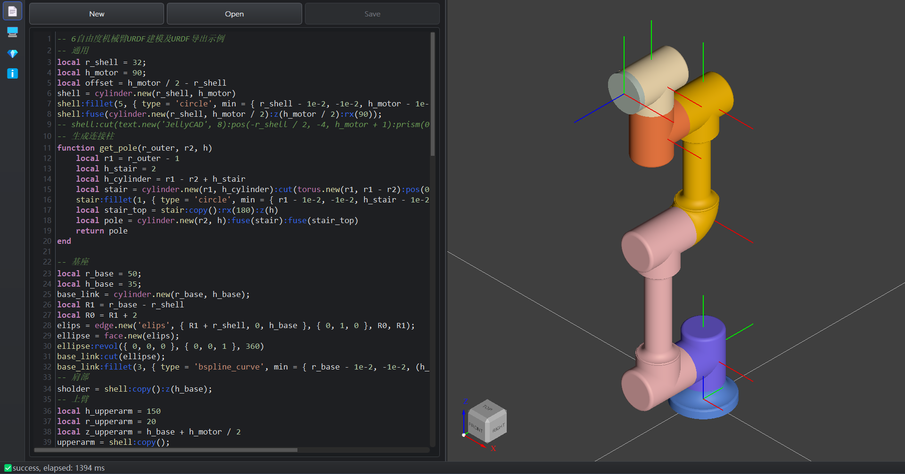
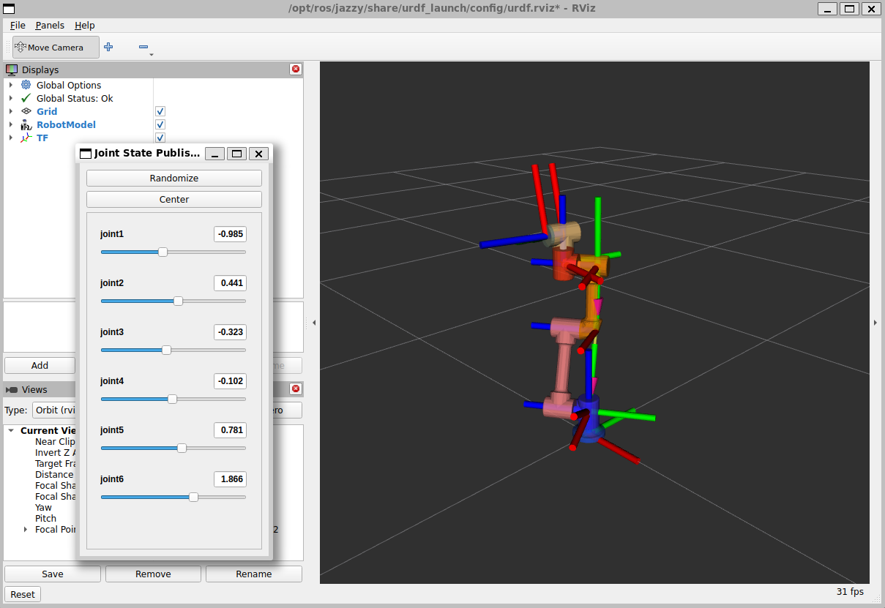

<div align="center">
  

  # JellyCAD

  **Open Source Programmable CAD Software**

  Modern open-source programmable CAD software designed for programmers, robotics developers, and parametric modeling enthusiasts

  

  [](LICENSE)
  [](https://github.com/Jelatine/JellyCAD)

  **[Official Website](https://jelatine.github.io/JellyCAD/)**

  **[Video Introduction](https://www.bilibili.com/video/BV1diBMB5EDU)**

</div>

**Languages:** English | [中文](README.zh.md)

---

## 🎯 Real-World Applications

In the [mockway_robotics](https://github.com/Jelatine/mockway_robotics) robotic arm project, JellyCAD is used to quickly build the robotic arm's base structure through Lua scripting.

[](https://www.bilibili.com/video/BV1LzBhBrEbg/)


## ✨ Features

- 🌐 **Cross-Platform Support** - Compatible with Windows, Linux, and macOS
- 📝 **Lua Script Programming** - Build 3D models using concise Lua language
- 🤖 **Robotics Development** - Export to URDF and MJCF for ROS/ROS2 and MuJoCo development
- 💾 **Multiple Export Formats** - Support for STL, STEP, and IGES file exports
- 🔧 **Rich Operations** - Boolean operations, filleting, chamfering, extrusion, and more
- 💬 **AI-Assisted Programming** - Integrated LLM dialogue for intelligent Lua script generation and modification

## 🤖 Robotics Applications

JellyCAD is designed specifically for robotics developers, providing a complete workflow for robot modeling and simulation:

### Supported Robot Formats

- **URDF (Unified Robot Description Format)** - Compatible with ROS1 and ROS2, supports complete link, joint, and inertia parameter definitions
- **MJCF (MuJoCo XML Format)** - Model format for MuJoCo physics simulation engine

### Typical Use Cases

- 📐 **Robotic Arm Modeling** - Quickly build multi-DOF robotic arm models using Lua scripts
- 🔗 **Kinematic Chain Design** - Precisely define joint pose relationships through DH parameters (MDH/SDH)
- ⚙️ **Parametric Modeling** - Batch generate robot models with different configurations programmatically
- 🎮 **Simulation Integration** - Seamlessly interface with mainstream simulation platforms like RViz, Gazebo, and MuJoCo
- 🔄 **Rapid Iteration** - Code-based modeling facilitates version control and design optimization

**Lua Script Modeling Example**



### Core Advantages

Compared to manually modeling in traditional CAD software and then converting to URDF, JellyCAD provides:

✅ One-click export of complete ROS package structure
✅ Automatic calculation of inertia tensors and center of mass
✅ Support for hierarchical relationships in complex assemblies
✅ Code-based modeling for easy parameterization and batch generation

**ROS2 + RViz Visualization**



**MuJoCo Physics Simulation**


> See Example 6 to learn how to build a 6-DOF robotic arm and export URDF using JellyCAD.

## 💬 AI-Assisted Programming

JellyCAD integrates LLM dialogue functionality to help you write Lua scripts more efficiently:


**How to Use:**

1. Click the **💬 button** in the editor toolbar to open the LLM dialogue window
2. Configure in settings:
   - Select AI service provider (OpenAI, Claude, DeepSeek, ModelScope, Aliyun, or custom)
   - Enter API Key
   - Select model
3. Enter your requirements (e.g., "Create a cube with side length 10")
4. Press `Ctrl+Enter` to send, AI will generate corresponding Lua code
5. Generated code will be automatically inserted into the editor

**Features:**
- ✅ Support for multiple mainstream AI service providers
- ✅ Streaming code generation with real-time feedback
- ✅ Intelligent understanding of JellyCAD API
- ✅ Support for code modification and optimization
- ✅ Automatic configuration saving


## 🛠️ Development Environment

### Core Dependencies

- **CMake** >= 3.24.0
- **C++ Compiler** (supports C++17 or higher)
- **vcpkg** (version 2025.06.13 or newer)

### Third-Party Libraries

- Qt6
- OpenCASCADE 7.9.0
- Sol2 3.5.0
- Lua 5.4

### Tested Platforms

- ✅ Windows 11 23H2 + Visual Studio 2022
- ✅ Ubuntu 22.04.5 LTS + GCC 11.4.0
- ✅ macOS 15.5

## 🚀 Quick Start

> 📖 For complete installation guide, see: [Installation Tutorial](https://jelatine.github.io/JellyCAD/guide/install.html)

### Install Dependencies

Use vcpkg to install required third-party libraries:

```bash
vcpkg install qtbase lua sol2 opencascade
```

### Build Project

```bash
# Clone repository
git clone https://github.com/Jelatine/JellyCAD.git
cd JellyCAD

# Create build directory
mkdir build
cd build

# Configure CMake (replace your_vcpkg_dir with actual path)
cmake .. -DCMAKE_TOOLCHAIN_FILE=(your_vcpkg_dir)/scripts/buildsystems/vcpkg.cmake

# Build project
cmake --build .
```

### Common Issues

**Ubuntu 24 Emoji Display Issue**

```bash
sudo apt install fonts-noto-color-emoji
```

## 📖 User Guide

### Command Line Mode

Run Lua script file:

```bash
./JellyCAD -f file.lua
```

Execute Lua script string:

```bash
./JellyCAD -c "print('Hello, World!')"
./JellyCAD -c "box.new():export_stl('box.stl')"
```

### GUI Mode

#### 🖱️ Mouse Operations

| Operation | Function |
|------|------|
| Left Click + Drag | Pan view |
| Right Click + Drag | Rotate view |
| Scroll Wheel | Zoom view |

#### ⌨️ Keyboard Shortcuts

| Shortcut | Function |
|--------|------|
| `Ctrl+N` | New file |
| `Ctrl+S` | Save file |
| `Ctrl+F` | Editor search |
| `Ctrl+/` | Toggle comment |
| `F5` | Run current script |


### 📚 Learning Resources

- [JellyCAD Documentation](https://jelatine.github.io/JellyCAD/guide/install.html)
- [Lua 5.4 Official Manual](https://www.lua.org/manual/5.4/)
- [Lua Tutorial](https://www.runoob.com/lua/lua-tutorial.html)

## 🔨 API Reference

### Global Functions

| Function | Description |
|------|------|
| `show(shape)` | Display single or multiple models in 3D interface |

### Basic Shape Classes

All shape classes inherit from the `shape` base class:

#### Solid Types (SOLID)

- 🎲 `box.new(width, height, depth)` - Box
- 🪵 `cylinder.new(radius, height)` - Cylinder
- 🏔️ `cone.new(radius1, radius2, height)` - Cone
- 🏀 `sphere.new(radius)` - Sphere
- 🍩 `torus.new(majorRadius, minorRadius)` - Torus
- 🧀 `wedge.new(dx, dy, dz, ltx)` - Wedge

#### Geometric Element Types

- 📍 `vertex` - Vertex
- ➖ `edge` - Edge (subtypes: `line`, `circle`, `ellipse`, `hyperbola`, `parabola`, `bezier`, `bspline`)
- 🛑 `wire` - Wire (subtype: `polygon`)
- 🟪 `face` - Face (subtypes: `plane`, `cylindrical`, `conical`)
- 🔠 `text` - Text

### Shape Base Class Methods

#### File Import

```lua
s = shape.new('model.stl')  -- Import STL or STEP file
```

#### Properties and Queries

| Method | Description |
|------|------|
| `copy()` | Return a copy of the shape |
| `type()` | Return shape type string |
| `color(color)` | Set color |
| `transparency(value)` | Set transparency |

#### Boolean Operations

| Method | Description |
|------|------|
| `fuse(shape)` | Fusion operation (union) |
| `cut(shape)` | Cut operation (difference) |
| `common(shape)` | Intersection operation |

#### Modification Operations

| Method | Description |
|------|------|
| `fillet(radius, options)` | Fillet |
| `chamfer(distance, options)` | Chamfer |

#### Transformation Operations

| Method | Description |
|------|------|
| `pos(x, y, z)` | Absolute position |
| `x(val)/y(val)/z(val)/rx(val)/ry(val)/rz(val)` | Absolute position/pose |
| `rot(rx, ry, rz)` | Absolute pose |
| `move(move_type, x, y, z)` | Relative translation and rotation, `move_type` is `'pos'` or `'rot'` |
| `prism(dx, dy, dz)` | Extrusion operation (`edge→face`, `face→solid`, `wire→shell`) |
| `revol(pos, dir, angle)` | Revolution operation |
| `scale(factor)` | Scale proportionally |

#### Export Operations

| Method | Description |
|------|------|
| `export_stl(filename, options)` | Export to STL format |
| `export_step(filename)` | Export to STEP format |
| `export_iges(filename)` | Export to IGES format |

#### Robot Export (URDF/MuJoCo)

- 📐 `axes.new(pose, length)` - Coordinate system (for defining joint poses)
- 🦴 `link.new(name, shape)` - Robot link
- 🔗 `joint.new(name, axes, type, limits)` - Robot joint

| Method | Description |
|------|------|
| `axes:copy()` | Return copy of coordinate system |
| `axes:move(x, y, z, rx, ry, rz)` | Translate and rotate along own coordinate system with RPY |
| `axes:mdh(alpha, a, d, theta)` | MDH pose transformation along own coordinate system |
| `axes:sdh(alpha, a, d, theta)` | SDH pose transformation along own coordinate system |
| `joint:next(link)` | Set next link, return link object |
| `link:add(joint)` | Add joint, return joint object |
| `link:export(options)` | Export to URDF/MuJoCo format |

> For detailed API reference, see [JellyCAD Documentation](https://jelatine.github.io/JellyCAD/guide/functions.html).

## 💡 Example Code

### Example 1: Basic Solids and Transformations

```lua
print("Hello, World!");
b = box.new(0.1, 1, 1); -- create a box with dimensions 0.1 x 1 x 1
b:pos(2, 2, 0); -- translate the box by 2 units in the x, y
b:rot(0, 0, -30); -- rotate the box by -30 degrees around the z axis
-- create a cylinder with radius 1, height 1, color lightblue, position {2, -2, 0}, rotate 20 degrees around the x axis
c = cylinder.new(1, 1):color("lightblue"):rx(20):pos(2, -2, 0);
-- create a cone with radius 1, height 0.2, color gray, position {-2, 2, 0}, roll 90 degrees(RPY)
n = cone.new(1, 0.2, 2):color("#808080"):rot(90, 0, 0):pos(-2, 2, 0);
s = sphere.new(0.5); -- create a sphere with radius 0.5
s:pos(-2, -2, 0.5):rot(0, 0, 0); -- set the position and rotation of the sphere
s:color("red"); -- set the color of the sphere to red
show({b,c,n,s});  -- display the objects
```


### Example 2: Fillets and Chamfers

```lua
print("Fillet OR Chamfer");
b1 = box.new(1, 1, 1):color('red3'):pos(2, 2, 0);
b1:fillet(0.2, { type = 'line', first = { 2, 2, 1 }, last = { 3, 2, 1 }, tol = 1e-4 }); -- fillet r=0.2 with specified edge endpoints, tolerance 1e-4
b2 = box.new(1, 1, 1):color('green3'):pos(2, -2, 0);
b2:fillet(0.2, { max = { 3, 3, 3 } }); -- fillet r=0.2 where edge endpoints are less than 3,3,3
c = cylinder.new(0.5, 1):color('gray'):pos(-2, -2, 0);
c:fillet(0.2, { type = 'circle' }); -- fillet r=0.2 with edge type constraint of circle
b3 = box.new(1, 1, 1):color('lightblue');
b3:chamfer(0.3, { min = { 0.5, -1, 0.5 }, max = { 9, 9, 9 } }); -- chamfer r=0.3 where edge endpoints are greater than 0.5,-1,0.5 and less than 9,9,9
show({ b1, b2, b3, c });
```


### Example 3: Polygon Extrusion

```lua
print('Polygon Prism')
points={{0,0,0},{0,1,0},{0.5,1,0},{0.5,1.5,0},{1.5,1.5,0},{1.5,1,0},{2,1,0},{2,0,0}};
p = polygon.new(points);
p:color("#FFF")
show(p);
f = face.new(p);
f:prism(0, 0, 1);
show(f);
```

### Example 4: Boolean Operations

```lua
print("Boolean Operation");
c=cylinder.new(10,10);
c:cut(cylinder.new(8,10):pos(0,0,1));
c:move('pos',20,20,0);
show(c);
s=sphere.new(10);
b=box.new(10,10,10);
s:common(b);
s:move('pos',-20,20,0);
show(s);
c1=cone.new(10,5,20):color('green4');
s1=sphere.new(10);
c1:fuse(s1);
c1:move('pos',-20,-20,0);
show(c1);
```


### Example 5: Export Files

```lua
print("Export");
cylinder.new(10, 10):export_stl('cylinder.stl', { type = 'ascii', radian = 0.05 })
sphere.new(10):export_step('sphere.step');
cone.new(10, 5, 20):color('green4'):export_iges('cone.iges')
```

## 📄 License

This project is licensed under the MIT License - see [LICENSE](LICENSE) file for details

## 🔗 References

### Official Documentation

- [OpenCASCADE Documentation](https://dev.opencascade.org/doc/overview/html/index.html)
- [Lua 5.4 Reference Manual](https://www.lua.org/manual/5.4/)

### Related Projects

- [JellyCAD Legacy Version](https://github.com/Jelatine/JellyCAD/tree/master)
- [Mayo - 3D CAD Viewer](https://github.com/fougue/mayo)

### Technical Articles

- [OpenCASCADE Boolean Operations](https://blog.csdn.net/weixin_45751713/article/details/139399875)
- [Fillet and Chamfer Implementation](https://blog.csdn.net/fcqwin/article/details/17204707)
- [Geometric Transformation Operations](https://blog.csdn.net/cfyouling/article/details/136400406)
- [Topological Edge Operations](https://blog.csdn.net/s634772208/article/details/130101544)
- [Edge Type Detection](https://www.cnblogs.com/occi/p/14619592.html)
- [Solid Creation Methods](https://developer.aliyun.com/article/235775)
