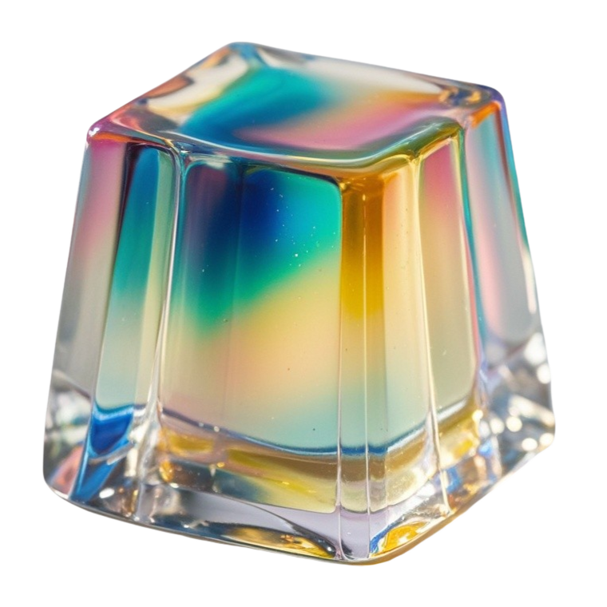
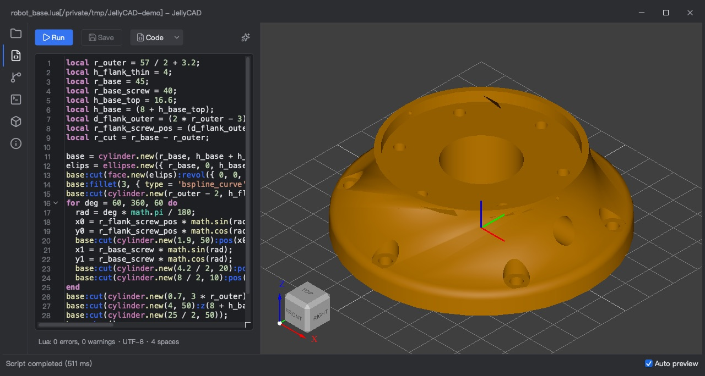
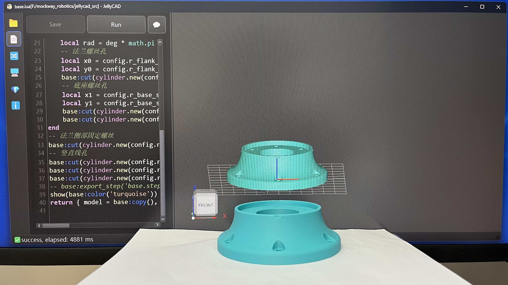
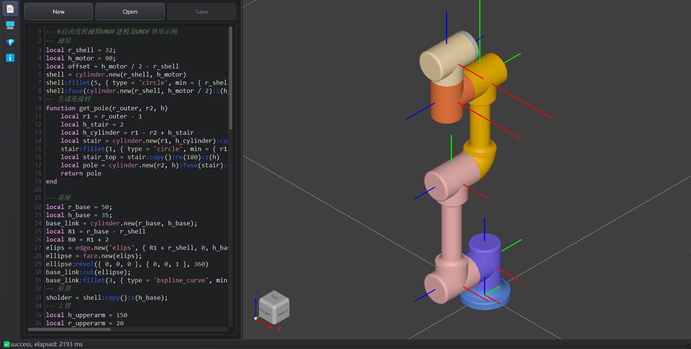
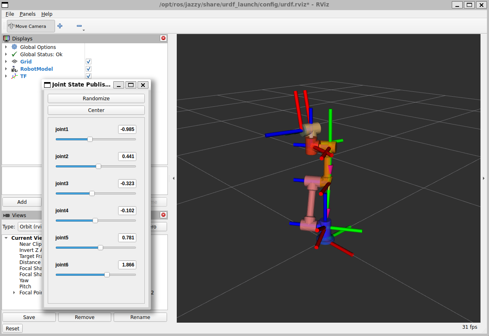
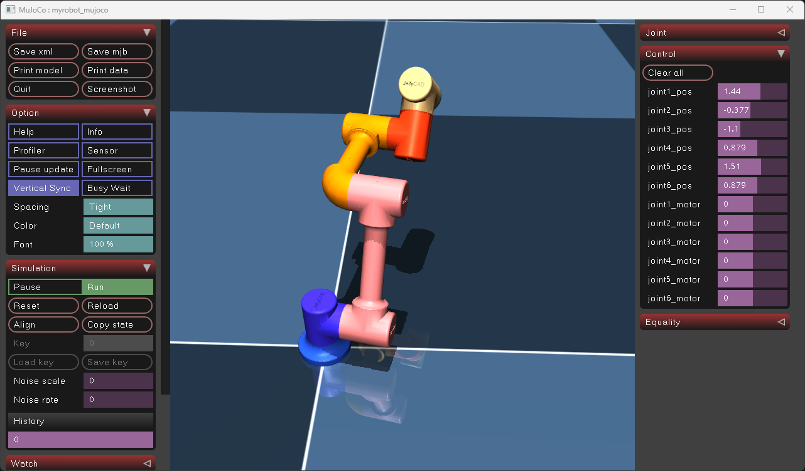
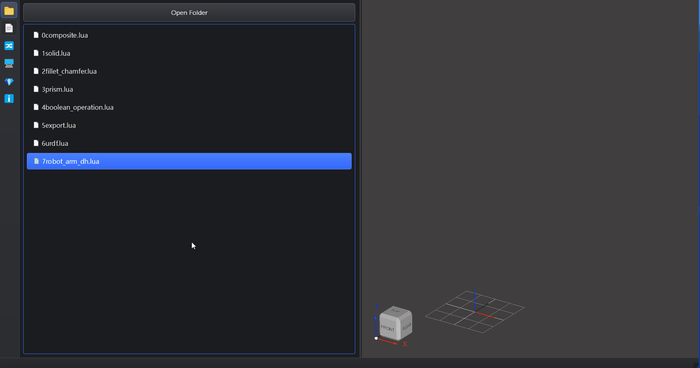
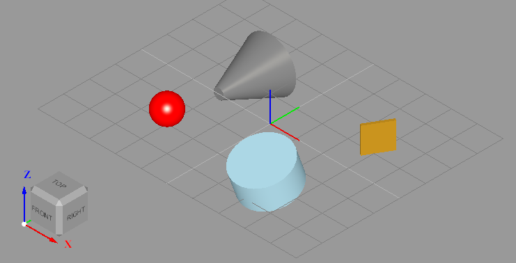
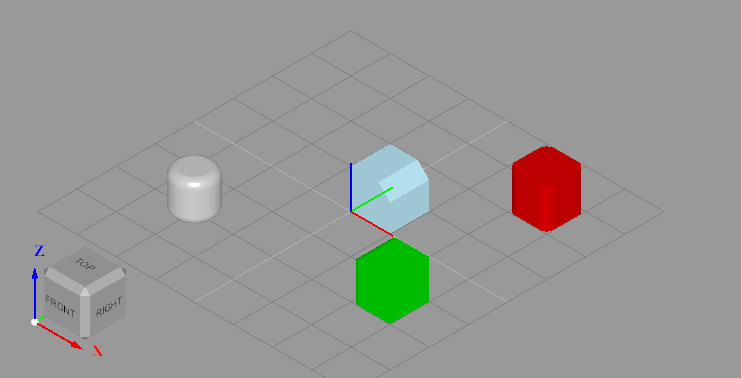
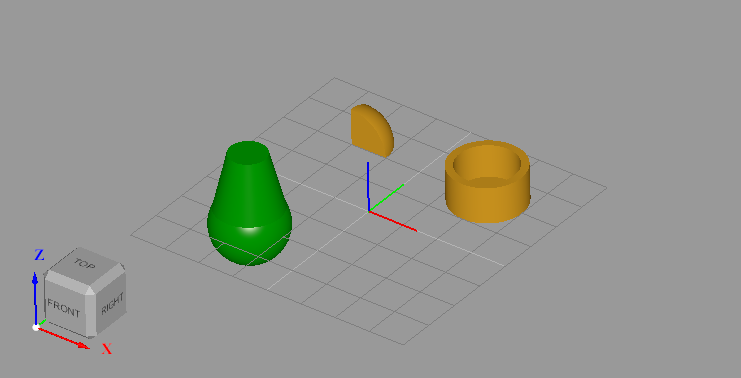

<div align="center">
  

  # JellyCAD

  **开源可编程 CAD 软件**

  现代开源可编程 CAD 软件专为程序员、机器人开发者和参数化建模爱好者设计

  

  [](LICENSE)
  [](https://github.com/Jelatine/JellyCAD)

  **[官方主页](https://jelatine.github.io/JellyCAD/)**
  
  **[视频介绍](https://www.bilibili.com/video/BV1diBMB5EDU)**

</div>

**语言:** [English](README.md) | 中文

---

## 🎯 实际应用

在 [mockway_robotics](https://github.com/Jelatine/mockway_robotics) 机械臂项目中，使用 JellyCAD 通过 Lua 脚本快速构建机械臂的基础结构。

[](https://www.bilibili.com/video/BV1LzBhBrEbg/)


## ✨ 特点

- 🌐 **跨平台支持** - 兼容 Windows、Linux 和 macOS 系统
- 📝 **Lua 脚本编程** - 使用简洁的 Lua 语言构造三维模型
- 🤖 **机器人开发** - 支持导出URDF和MJCF，方便ROS/ROS2和mujoco开发
- 💾 **多格式导出** - 支持导出 STL、STEP、IGES 格式文件
- 🔧 **丰富的操作** - 支持布尔运算、圆角、倒角、拉伸等多种建模操作
- 💬 **AI 辅助编程** - 集成大模型对话功能，智能生成和修改 Lua 脚本

## 🤖 机器人应用

JellyCAD 专为机器人开发者设计，提供完整的机器人建模与仿真工作流：

### 支持的机器人格式

- **URDF (Unified Robot Description Format)** - 兼容 ROS1 和 ROS2，支持完整的连杆、关节、惯性参数定义
- **MJCF (MuJoCo XML Format)** - 支持 MuJoCo 物理仿真引擎的模型格式

### 典型应用场景

- 📐 **机械臂建模** - 使用 Lua 脚本快速构建多自由度机械臂模型
- 🔗 **运动学链设计** - 通过 DH 参数（MDH/SDH）精确定义关节位姿关系
- ⚙️ **参数化建模** - 利用编程方式批量生成不同配置的机器人模型
- 🎮 **仿真集成** - 无缝对接 RViz、Gazebo、MuJoCo 等主流仿真平台
- 🔄 **快速迭代** - 代码化建模方式便于版本控制和设计优化

**Lua 脚本建模示例**



### 核心优势

相比传统 CAD 软件手动建模后再转换为 URDF，JellyCAD 提供：

✅ 一键导出完整的 ROS 功能包结构
✅ 自动计算惯性张量和质心位置
✅ 支持复杂装配体的层级关系
✅ 代码化建模便于参数化和批量生成

**ROS2 + RViz 可视化**



**MuJoCo 物理仿真**



> 详见示例 6 了解如何使用 JellyCAD 构建 6 自由度机械臂并导出 URDF。

## 💬 AI 辅助编程

JellyCAD 集成了大模型对话功能，帮助您更高效地编写 Lua 脚本：



**使用方法：**

1. 点击编辑器工具栏的 **💬 按钮**，打开 LLM 对话窗口
2. 在设置中配置：
   - 选择 AI 服务提供商（OpenAI、Claude、DeepSeek、ModelScope、Aliyun 或自定义）
   - 输入 API Key
   - 选择模型
3. 输入您的需求（如"创建一个边长为 10 的立方体"）
4. 按 `Ctrl+Enter` 发送，AI 将生成相应的 Lua 代码
5. 生成的代码会自动插入到编辑器中

**功能特点：**
- ✅ 支持多家主流 AI 服务商
- ✅ 代码流式生成，实时反馈
- ✅ 智能理解 JellyCAD API
- ✅ 支持代码修改和优化
- ✅ 自动保存配置信息


## 🛠️ 开发环境

### 核心依赖

- **CMake** >= 3.24.0
- **C++ 编译器** (支持 C++17 或更高版本)
- **vcpkg** (2026.06.24 或更新版本)

### 第三方库

- Qt6
- OpenCASCADE 7.9.0
- Sol2 3.5.0
- Lua 5.4

### 测试平台

- ✅ Windows 11 23H2 + Visual Studio 2022
- ✅ Ubuntu 22.04.5 LTS + GCC 11.4.0
- ✅ macOS 15.5

## 🚀 快速开始

> 📖 完整安装指南请参考：[安装教程](https://jelatine.github.io/JellyCAD/guide/install.html)

### 安装依赖

以下两种方式任选其一：

**方式一：使用 vcpkg 编译**

```bash
git clone https://github.com/Microsoft/vcpkg.git -b 2026.06.24
./vcpkg/bootstrap-vcpkg.sh        # Windows: .\vcpkg\bootstrap-vcpkg.bat
./vcpkg/vcpkg install qtbase lua sol2 opencascade
./vcpkg/vcpkg install gtest       # 可选，仅单元测试需要
```

> Ubuntu 下编译 qtbase 需要先安装系统依赖，参考 [ci.yml](.github/workflows/ci.yml) 中的「安装依赖」步骤。

**方式二：下载预编译的 vcpkg**

[JellyCAD-vcpkg](https://github.com/Jelatine/JellyCAD-vcpkg) 将预编译好的 `vcpkg` 目录（含 gtest）发布在 Release 中，CI 也使用这份产物。在 JellyCAD 源码目录下执行（Windows 请使用 Git Bash）：

```bash
# PLATFORM: Windows / Linux / macOS
gh release download vcpkg-2026.06.24 -R Jelatine/JellyCAD-vcpkg -p "vcpkg-PLATFORM.tar.gz.part-*" -D vcpkg_dl
cat vcpkg_dl/* | tar -xzf -
rm -rf vcpkg_dl
```

预编译产物构建于 GitHub Actions 的 `windows-2025-vs2026`（Visual Studio 2026）、`ubuntu-24.04`、`macos-26`（arm64）环境，仅适用于相同系统和编译器，其他环境请使用方式一。

### 编译项目

```bash
# 克隆仓库
git clone https://github.com/Jelatine/JellyCAD.git
cd JellyCAD

# 创建构建目录
mkdir build
cd build

# 配置 CMake（替换 your_vcpkg_dir 为实际路径）
# 添加 -DBUILD_TESTS=ON 可编译单元测试（需要 gtest）
cmake .. -DCMAKE_BUILD_TYPE=Release -DCMAKE_TOOLCHAIN_FILE=(your_vcpkg_dir)/scripts/buildsystems/vcpkg.cmake

# 构建项目
cmake --build . --config Release
```

### 常见问题

**Ubuntu 24 Emoji 显示问题**

```bash
sudo apt install fonts-noto-color-emoji
```

## 📖 使用指南

### 命令行模式

运行 Lua 脚本文件：

```bash
./JellyCAD -f file.lua
```

执行 Lua 脚本字符串：

```bash
./JellyCAD -c "print('Hello, World!')"
./JellyCAD -c "box.new():export_stl('box.stl')"
```

### 图形界面模式

#### 🖱️ 鼠标操作

| 操作 | 功能 |
|------|------|
| 左键拖拽 | 平移视图 |
| 右键拖拽 | 旋转视图 |
| 滚轮 | 缩放视图 |

#### ⌨️ 快捷键

| 快捷键 | 功能 |
|--------|------|
| `Ctrl+N` | 新建文件 |
| `Ctrl+S` | 保存文件 |
| `Ctrl+F` | 编辑器搜索 |
| `Ctrl+/` | 注释/取消注释 |
| `F5` | 运行当前脚本 |


### 📚 学习资源

- [JellyCAD 帮助文档](https://jelatine.github.io/JellyCAD/guide/install.html)
- [Lua 5.4 官方手册](https://www.lua.org/manual/5.4/)
- [Lua 菜鸟教程](https://www.runoob.com/lua/lua-tutorial.html)

## 🔨 API 参考

### 全局函数

| 函数 | 功能 |
|------|------|
| `show(shape)` | 在 3D 界面显示单个或多个模型 |

### 基础形状类

所有形状类均继承自 `shape` 基类：

#### 实体类型（SOLID）

- 🎲 `box.new(width, height, depth)` - 长方体
- 🪵 `cylinder.new(radius, height)` - 圆柱体
- 🏔️ `cone.new(radius1, radius2, height)` - 圆锥体
- 🏀 `sphere.new(radius)` - 球体
- 🍩 `torus.new(majorRadius, minorRadius)` - 圆环体
- 🧀 `wedge.new(dx, dy, dz, ltx)` - 楔形体

#### 几何元素类型

- 📍 `vertex` - 顶点
- ➖ `edge` - 边缘（子类型： `line`、`circle`、`ellipse`、`hyperbola`、`parabola`、`bezier` 、`bspline` ）
- 🛑`wire` - 线（子类型：`polygon`）
- 🟪 `face` - 面（子类型：`plane`、`cylindrical`、`conical`）
- 🔠 `text` - 文本

### Shape 基类方法

#### 文件导入

```lua
s = shape.new('model.stl')  -- 导入 STL 或 STEP 文件
```

#### 属性和查询

| 方法 | 功能 |
|------|------|
| `copy()` | 返回形状的副本 |
| `type()` | 返回形状类型字符串 |
| `color(color)` | 设置颜色 |
| `transparency(value)` | 设置透明度 |

#### 布尔运算

| 方法 | 功能 |
|------|------|
| `fuse(shape)` | 融合操作（并集） |
| `cut(shape)` | 剪切操作（差集） |
| `common(shape)` | 相交操作（交集） |

#### 修饰操作

| 方法 | 功能 |
|------|------|
| `fillet(radius, options)` | 圆角 |
| `chamfer(distance, options)` | 倒角 |

#### 变换操作

| 方法 | 功能 |
|------|------|
| `pos(x, y, z)` | 绝对位置 |
| `x(val)/y(val)/z(val)/rx(val)/ry(val)/rz(val)` | 绝对位置/姿态 |
| `rot(rx, ry, rz)` | 绝对姿态 |
| `move(move_type, x, y, z)` | 相对平移和旋转，`move_type` 为 `'pos'` 或 `'rot'` |
| `prism(dx, dy, dz)` | 拉伸操作（`edge→face`、`face→solid`、`wire→shell`） |
| `revol(pos, dir, angle)` | 旋转体生成操作 |
| `scale(factor)` | 按比例缩放 |

#### 导出操作

| 方法 | 功能 |
|------|------|
| `export_stl(filename, options)` | 导出 STL 格式文件 |
| `export_step(filename)` | 导出 STEP 格式文件 |
| `export_iges(filename)` | 导出 IGES 格式文件 |

#### 机器人导出(URDF/Mujoco)

- 📐 `axes.new(pose, length)` - 坐标系（用于定义关节位姿）
- 🦴 `link.new(name, shape)` - 机器人连杆
- 🔗 `joint.new(name, axes, type, limits)` - 机器人关节

| 方法 | 功能 |
|------|------|
| `axes:copy()` | 返回坐标系副本 |
| `axes:move(x, y, z, rx, ry, rz)` | 沿自身坐标系进行平移及RPY姿态变换 |
| `axes:mdh(alpha, a, d, theta)` | 沿自身坐标系进行 MDH 位姿变换 |
| `axes:sdh(alpha, a, d, theta)` | 沿自身坐标系进行 SDH 位姿变换 |
| `joint:next(link)` | 设置下一个连杆, 返回连杆对象 |
| `link:add(joint)` | 添加关节, 返回关节对象 |
| `link:export(options)` | 导出 URDF/Mujoco 格式文件 |

> 详细的 API 参考请参考 [JellyCAD 帮助文档](https://jelatine.github.io/JellyCAD/guide/functions.html)。

## 💡 示例代码

### 示例 1：基础实体与变换

```lua
print("Hello, World!");
b = box.new(0.1, 1, 1); -- create a box with dimensions 0.1 x 1 x 1
b:pos(2, 2, 0); -- translate the box by 2 units in the x, y
b:rot(0, 0, -30); -- rotate the box by -30 degrees around the z axis
-- create a cylinder with radius 1, height 1, color lightblue, position {2, -2, 0}, rotate 20 degrees around the x axis
c = cylinder.new(1, 1):color("lightblue"):rx(20):pos(2, -2, 0);
-- create a cone with radius 1, height 0.2, color gray, position {-2, 2, 0}, roll 90 degrees(RPY)
n = cone.new(1, 0.2, 2):color("#808080"):rot(90, 0, 0):pos(-2, 2, 0);
s = sphere.new(0.5); -- create a sphere with radius 0.5
s:pos(-2, -2, 0.5):rot(0, 0, 0); -- set the position and rotation of the sphere
s:color("red"); -- set the color of the sphere to red
show({b,c,n,s});  -- display the objects
```



### 示例 2：圆角和倒角

```lua
print("Fillet OR Chamfer");
b1 = box.new(1, 1, 1):color('red3'):pos(2, 2, 0);
b1:fillet(0.2, { type = 'line', first = { 2, 2, 1 }, last = { 3, 2, 1 }, tol = 1e-4 }); -- 圆角 r=0.2 指定边缘始末点，容差1e-4
b2 = box.new(1, 1, 1):color('green3'):pos(2, -2, 0);
b2:fillet(0.2, { max = { 3, 3, 3 } }); -- 圆角 r=0.2 边缘始末点同时小于 3,3,3
c = cylinder.new(0.5, 1):color('gray'):pos(-2, -2, 0);
c:fillet(0.2, { type = 'circle' }); -- 圆角 r=0.2 限制条件为边缘类型是圆形
b3 = box.new(1, 1, 1):color('lightblue');
b3:chamfer(0.3, { min = { 0.5, -1, 0.5 }, max = { 9, 9, 9 } }); -- 倒角 r=0.3 边缘始末点同时大于 0.5,-1,0.5 且小于 9,9,9
show({ b1, b2, b3, c });
```



### 示例 3：拉伸多边形

```lua
print('Polygon Prism')
points={{0,0,0},{0,1,0},{0.5,1,0},{0.5,1.5,0},{1.5,1.5,0},{1.5,1,0},{2,1,0},{2,0,0}};
p = polygon.new(points);
p:color("#FFF")
show(p);
f = face.new(p);
f:prism(0, 0, 1);
show(f);
```

### 示例 4：布尔操作

```lua
print("Boolean Operation");
c=cylinder.new(10,10);
c:cut(cylinder.new(8,10):pos(0,0,1));
c:move('pos',20,20,0);
show(c);
s=sphere.new(10);
b=box.new(10,10,10);
s:common(b);
s:move('pos',-20,20,0);
show(s);
c1=cone.new(10,5,20):color('green4');
s1=sphere.new(10);
c1:fuse(s1);
c1:move('pos',-20,-20,0);
show(c1);
```



### 示例 5：导出文件

```lua
print("Export");
cylinder.new(10, 10):export_stl('cylinder.stl', { type = 'ascii', radian = 0.05 })
sphere.new(10):export_step('sphere.step');
cone.new(10, 5, 20):color('green4'):export_iges('cone.iges')
```

## 📄 许可证

本项目采用 MIT 许可证 - 详见 [LICENSE](LICENSE) 文件

## 🔗 参考资源

### 官方文档

- [OpenCASCADE 文档](https://dev.opencascade.org/doc/overview/html/index.html)
- [Lua 5.4 参考手册](https://www.lua.org/manual/5.4/)

### 相关项目

- [JellyCAD 旧版本](https://github.com/Jelatine/JellyCAD/tree/master)
- [Mayo - 3D CAD 查看器](https://github.com/fougue/mayo)

### 技术文章

- [OpenCASCADE 布尔运算](https://blog.csdn.net/weixin_45751713/article/details/139399875)
- [圆角倒角实现](https://blog.csdn.net/fcqwin/article/details/17204707)
- [几何变换操作](https://blog.csdn.net/cfyouling/article/details/136400406)
- [拓扑边操作](https://blog.csdn.net/s634772208/article/details/130101544)
- [边缘类型判断](https://www.cnblogs.com/occi/p/14619592.html)
- [实体创建方法](https://developer.aliyun.com/article/235775)
