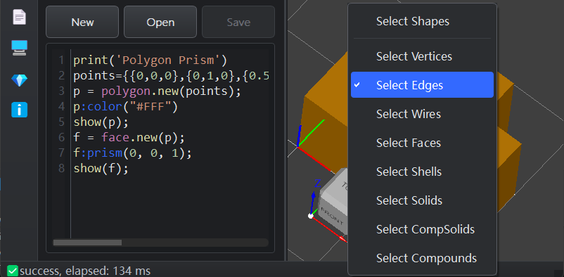

# 圆角和倒角操作

在3D建模中，圆角（Fillet）和倒角（Chamfer）是两种常用的边缘处理技术，用于改善模型的外观和功能性。本指南将介绍如何在JellyCAD中使用这些工具。

## 圆角（Fillet）

圆角操作可以将尖锐的边缘转换为光滑的圆弧过渡，常用于美化模型外观、消除应力集中点。

**语法：**
```lua
shape:fillet(radius, conditions)
```

**参数说明：**
- `radius` - *number* - 圆角半径
- `conditions` - *table* - 边缘筛选条件（可选）

**示例：**

```lua
-- 对所有边缘应用2的圆角
box.new(10, 10, 10):fillet(2,{}):show()

-- 对特定边缘应用圆角
box.new(10, 10, 10):fillet(2, {type = "line", min = {-1, -1, -1}, max = {11, 11, 1}}):show()
```

## 倒角（Chamfer）

倒角操作将尖锐的边缘切削成平面过渡，常用于装配件的导向、去除毛刺等场景。

**语法：**
```lua
shape:chamfer(distance, conditions)
```

**参数说明：**
- `distance` - *number* - 倒角距离（从边缘开始的切削长度）
- `conditions` - *table* - 边缘筛选条件（可选）

**示例：**
```lua
-- 对所有边缘应用1mm的倒角
box = Box(10, 10, 10)
box:chamfer(1)

-- 对特定边缘应用倒角
box:chamfer(0.5, {type = "line", first = {0, 0, 0}, last = {10, 0, 0}, tol = 1e-3})
```

## 边缘筛选条件（conditions）

`conditions` 参数是一个可选的表（table），用于精确筛选需要处理的边缘。如果不提供此参数，操作将应用于形状的所有边缘。

### 筛选参数

| 参数 | 类型 | 说明 |
|------|------|------|
| `type` | *string* | 边缘类型筛选，可选值：`line`（直线）、`circle`（圆）、`ellipse`（椭圆）、`hyperbola`（双曲线）、`parabola`（抛物线）、`bezier_curve`（贝塞尔曲线）、`bspline_curve`（B样条曲线）、`offset_curve`（偏移曲线）、`other_curve`（其他曲线） |
| `first` | *array3* | 边缘起点坐标 `{x, y, z}` |
| `last` | *array3* | 边缘终点坐标 `{x, y, z}` |
| `tol` | *number* | 边缘起始点判断的容差，默认值为 `1e-6` |
| `min` | *array3* | 筛选区域的最小边界点 `{x, y, z}` |
| `max` | *array3* | 筛选区域的最大边界点 `{x, y, z}` |

## 提示

- 可以组合多个参数来精确定位边缘
- `min` 和 `max` 定义的是一个三维包围盒，只有位于此区域内的边缘会被选中
- 使用 `tol` 参数可以处理浮点数精度问题

## 使用方法

### 方法一：手动编写筛选条件

通过手动定义筛选条件来精确控制需要处理的边缘。

**示例1：按类型筛选**
```lua
-- 只对直线边缘应用圆角
box = Box(10, 10, 10)
box:fillet(0.3, {type = "line"})
```

**示例2：按区域筛选**
```lua
-- 配置一个包围盒，筛选指定区域内的边缘
conditions = {
    type = "line",
    min = {0, 0, 0},
    max = {100, 100, 0}
}
shape:fillet(0.5, conditions)
```

**示例3：按起止点筛选**
```lua
-- 精确指定边缘的起点和终点
edge_condition = {
    type = "line",
    first = {0, 0, 0},
    last = {10, 0, 0},
    tol = 1e-3
}
shape:chamfer(0.2, edge_condition)
```

### 方法二：可视化选择边缘

对于复杂模型，通过3D视图直接选择边缘是更加直观的方式。

**操作步骤：**

1. **显示模型** - 在编辑器中运行脚本，将模型显示到3D视图区。

   

2. **切换选择模式** - 右键点击3D视图区，在弹出菜单中选择 `Select Edges` 切换为边缘选择模式。

   

3. **选择边缘** - 在3D视图中用鼠标点击需要处理的边缘，被选中的边缘会高亮显示。右侧工作区会显示选中边缘的详细信息。

   

4. **插入边缘信息** - 点击工作区中的 `Insert edge info to editor` 按钮，边缘的筛选条件将自动插入到编辑器的当前光标位置。

   

5. **编写操作代码** - 在插入的边缘信息基础上，添加圆角或倒角操作指令。

   

**完整示例：**
```lua
-- 通过3D视图选择获得的边缘信息
edge_info = {type = 'line', first = {2, 0, 1}, last = {0, 0, 1}, tol = 1e-3}

-- 对选中的边缘应用圆角，半径为0.2
shape:fillet(0.2, edge_info)

-- 或对选中的边缘应用倒角，距离为0.15
-- shape:chamfer(0.15, edge_info)
```

## 注意事项

1. **半径/距离限制**：圆角半径或倒角距离不能超过相邻面的尺寸，否则操作可能失败。
2. **边缘连续性**：对于相邻的多条边缘，建议使用相同的圆角半径以保持连续性。
3. **性能考虑**：对复杂模型应用圆角/倒角会增加计算时间，建议合理使用筛选条件。
4. **容差设置**：在使用 `first` 和 `last` 参数时，适当增大 `tol` 值可以提高边缘匹配的成功率。
5. **操作顺序**：圆角和倒角操作会改变模型的拓扑结构，建议在建模流程的后期阶段执行。
