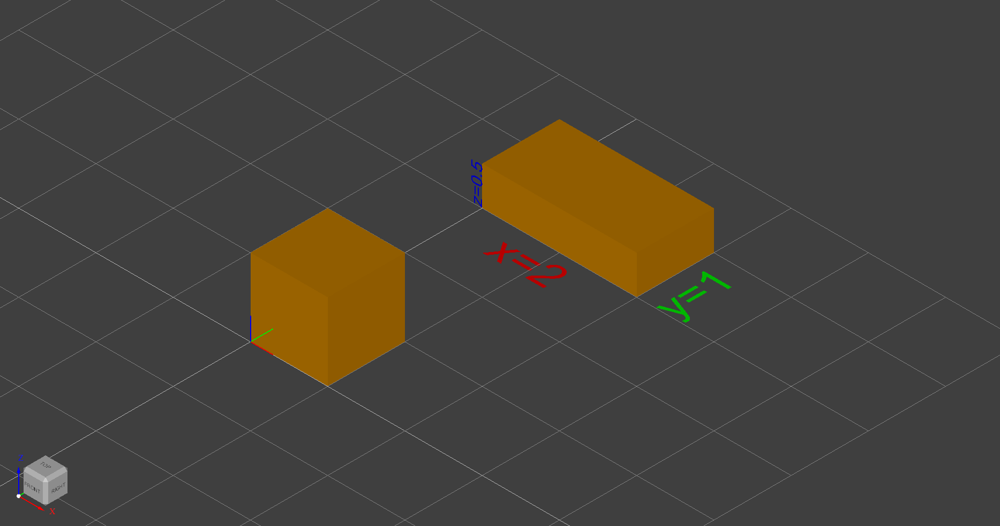
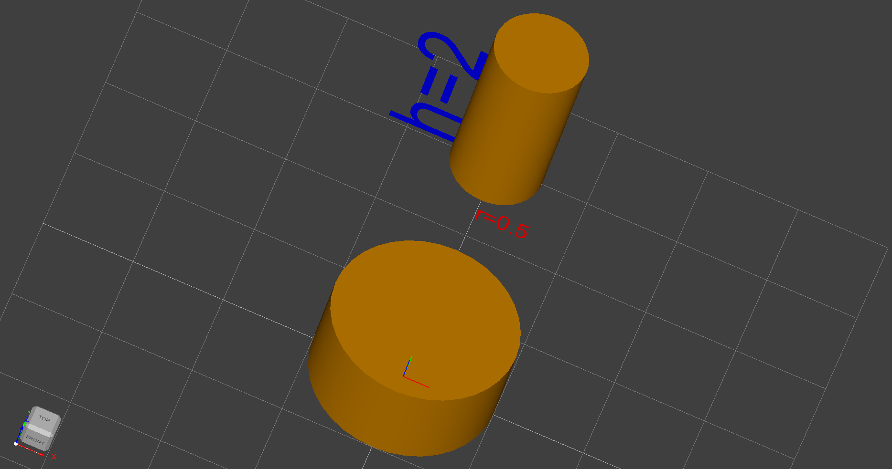
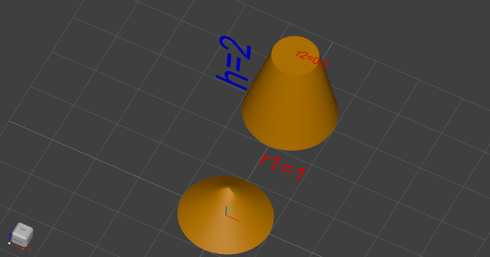
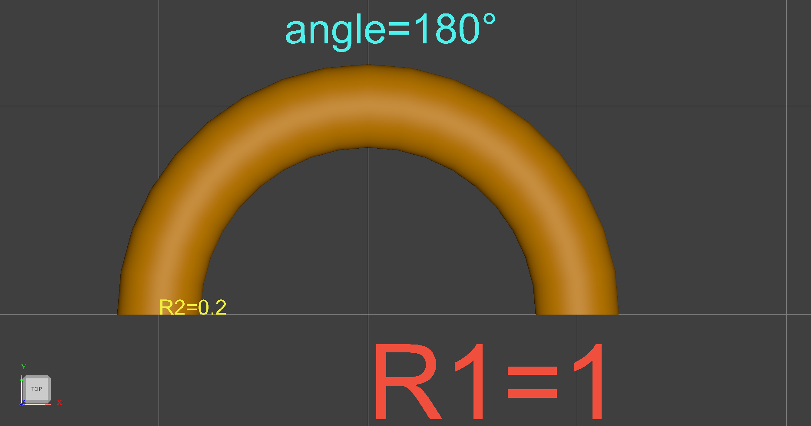
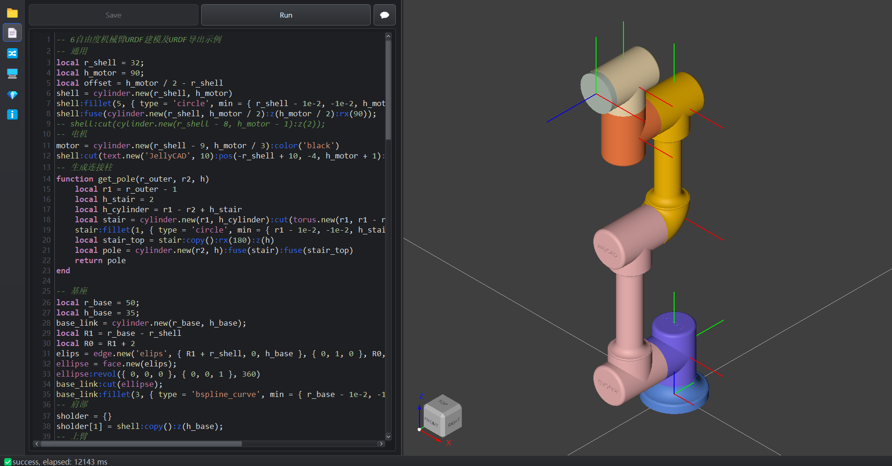
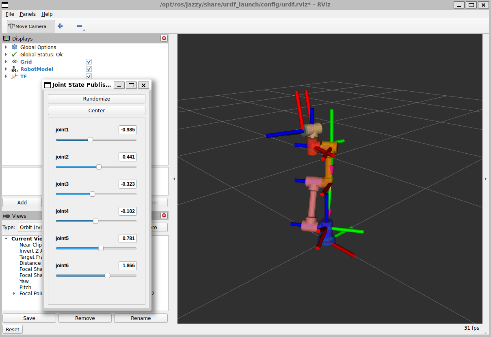

# 使用脚本

---

## 🌍 全局函数

### 显示与导出

#### **`show()`** - 显示对象
```lua
show(object)        -- 显示单个对象
show(object_list)   -- 显示对象列表
```
**参数：**
- `object` - *shape* - 要显示的形状对象
- `object_list` - *table* - 形状对象列表 `{obj1, obj2, ...}`

---

## 📦 形状对象

### 立体形状

#### **`shape`** - 基础形状类
```lua
shape.new(filename)  -- 从文件加载（支持 *.step, *.stl）
```

所有形状的基类，可从文件加载现有模型。

---

#### **`box`** - 长方体

创建一个长方体

```lua
box.new()                 -- 默认: width=depth=height=1
box.new(width, depth, height)          -- 自定义尺寸
box.new(vertex1, vertex2) -- 通过两个顶点构造长方体，从(vertex1)到(vertex2)
```
**参数：**
- `width` - *number* - 宽度
- `depth` - *number* - 深度
- `height` - *number* - 高度
- `vertex1` - *table* - 第一个顶点 `{x1,y1,z1}`
- `vertex2` - *table* - 第二个顶点 `{x2,y2,z2}`

**示例：**

```lua
box.new():show()                -- 单位立方体，从(0,0,0)到(1,1,1)
box.new(2, 1, 0.5):y(3):show()  -- 长方体，从(0,0,0)到(2,1,0.5)
-- 边长信息文本
text.new('x=2', 0.5):x(0.5):y(2.5):color('red'):show()
text.new('y=1', 0.5):x(2.5):y(3):rz(90):color('green'):show()
text.new('z=0.5', 0.2):x(0):y(3):rx(90):ry(-90):color('blue'):show()
```



---

#### **`cylinder`** - 圆柱体

创建一个原点在底部圆心的圆柱体

```lua
cylinder.new()            -- 默认: r=h=1
cylinder.new(r, h)        -- 自定义尺寸
cylinder.new(other_cyl)   -- 复制构造
```
**参数：**
- `r` - *number* - 半径
- `h` - *number* - 高度

**示例：**

```lua
cylinder.new():show()
cylinder.new(0.5, 2):y(3):show()
```



---

#### **`cone`** - 圆锥/圆台

创建一个原点在底部圆心的圆圆锥/圆台

```lua
cone.new()                -- 默认: r1=1,r2=0,h=1
cone.new(r1, r2, h)       -- 自定义尺寸
cone.new(other_cone)      -- 复制构造
```
**参数：**

- `r1` - *number* - 底部半径
- `r2` - *number* - 顶部半径（r2=0 为圆锥）
- `h` - *number* - 高度

**示例：**

```lua
cone.new():show()
cone.new(1, 0.5, 2):y(3):show()
```



---

#### **`sphere`** - 球体

创建一个原点在球心的球体

```lua
sphere.new()              -- 默认: r=1
sphere.new(r)             -- 自定义半径
sphere.new(other_sphere)  -- 复制构造
```
**参数：**
- `r` - *number* - 半径

#### **`torus`** - 圆环

创建一个原点在环心的圆环

```lua
torus.new()              -- 默认: R1=2,R2=1,angle=360
torus.new(R1, R2, angle)
torus.new(other_torus)
```

**参数：**

- `R1` - *number* - 从管道中心到环面中心的距离
- `R2` - *number* - 管道半径
- `angle` - *number* - 角度(deg)

**示例：**

```lua
torus.new(1, 0.5):show()
torus.new(1, 0.2, 180):y(3):show()
```



#### **`wedge`** - 楔形

创建一个从原点开始的楔形

```lua
wedge.new()              -- 默认: dx=dy=dz=1,ltx=0
wedge.new(dx, dy, dz, ltx)
wedge.new(dx, dy, dz, xmin, zmin, xmax, zmax)
wedge.new(other_wedge)
```

**参数：**

- `dx, dy, dz` - *number* - 各个方向的长度
- `ltx` - *number* - 楔形中心到X轴的距离
- `xmin, zmin, xmax, zmax` - *number* - 面在`dy`的最大最小值


---

### 二维形状

#### **`vertex`** - 顶点
```lua
vertex.new(x, y, z)
vertex.new(other_vertex)
```

**参数：**
- `x/y/z` - *number* - 顶点位置坐标

---

#### **`edge`** - 边缘
```lua
edge.new(type, vec1, vec2)
edge.new(type, vec1, vec2, r1)
edge.new(type, vec1, vec2, r1, r2)
edge.new(other_edge)
```

**参数：**
- `type` - *string* - 边缘类型
  - `"lin"` - 直线
  - `"circ"` - 圆
  - `"elips"` - 椭圆
  - `"hypr"` - 双曲线
  - `"parab"` - 抛物线
- `vec1` - *table* - 3D点坐标 `{x, y, z}`
- `vec2` - *table* - 3D方向向量 `{x, y, z}`
- `r1` - *number* - 半径（circ/elips/hypr/parab 使用）
- `r2` - *number* - 第二半径（elips/hypr 使用）

**子类：**

```lua
-- 直线
line.new(vertex1, vertex2) -- vertex1:起点[array3], vertex2:终点[array3]
-- 圆形
circle.new(center, normal, radius) -- center:圆心[array3], normal:法向量[array3], radius:半径[number]
-- 椭圆形
ellipse.new(center, normal, radius1, radius2) -- radius1:主半径[number], radius2:小半径[number]
-- 双曲线
hyperbola.new(center, normal, radius1, radius2, p1, p2) -- p1:起点偏移[number], p2:终点偏移[number]
-- 抛物线
parabola.new(center, normal, radius, p1, p2)
-- 贝塞尔曲线
bezier.new(poles) -- poles:极点[array3的数组]
bezier.new(poles, weights) -- weights:权重[number的数组]，数据量与极点相同
-- B样条曲线
bspline.new(poles, knots, multiplicities, degree) -- knots:节点向量[number的数组], multiplicities: [number的数组], degree:次数[number]
bspline.new(points) -- 近似通过一组点的B样条曲线 points:点[array3的数组]
-- 圆弧
arc.new(p1, p2, p3) -- p1:起点[array3], p2:圆弧上一点[array3], p3:终点[array3]
```

**示例：**

```lua
line.new({ 0, 0, 0 }, { 1, 1, 1 }):show()
circle.new({ 1, 1, 1 }, { 1, 1, 1 }, 3):show()
ellipse.new({ 1, 1, 1 }, { 1, 1, 1 }, 4, 2):show()
hyperbola.new({ 0, 0, 0 }, { 1, 1, 1 }, 4, 2, -2, 2):show()
parabola.new({ 2, 1, 3 }, { 1, 1, 1 }, 3, -2, 2):show()
bezier.new({ { 0, 0, 0 }, { 1, 1, 1 }, { 0, 2, 3 } }):show()
bezier.new({ { 0, 0, 0 }, { 1, 1, 1 }, { 0, 2, 3 } }, { 1, 0.2, 1 }):show()
bspline.new({ { 0, 0, 0 }, { 1, 2, 1 }, { 2, 2, 2 }, { 3, 0, 3 } }, { 0, 1 }, { 4, 4 }, 3):show()
-- 创建一个螺旋线样条曲线
local r,p,h,n=1,2,10,{}
for i=0,(100*h/p) do t=i/(100*h/p) a=2*p*math.pi*t n[i+1]={r*math.cos(a),r*math.sin(a),h*t}end
bspline.new(n):show()
arc.new({ 0, 0, 0 }, { 1, 1, 1 }, { 0, 0, 2 }):show()
```


---

#### **`wire`** - 线框
```lua
wire.new(list)         -- 从边缘列表创建
wire.new(other_wire)   -- 复制构造
```
**参数：**
- `list` - *table* - 边缘或线框对象列表 `{edge1, edge2, ...}`

---

#### **`polygon`** - 多边形
```lua
polygon.new(point_list)     -- 从点列表创建
polygon.new(other_polygon)  -- 复制构造
```
**参数：**
- `point_list` - *table* - 3D点列表 `{point1, point2, ...}`, 其中point:`{x,y,z}`

**示例：**

```lua
local triangle = polygon.new({
    {0, 0, 0},
    {1, 0, 0},
    {0.5, 1, 0}
})
```

---

#### **`face`** - 面
```lua
face.new(shape_object)  -- 从线框/边缘/多边形创建面
face.new(other_face)    -- 复制构造
```
**参数：**
- `shape_object` - *shape* - wire、edge 或 polygon 对象


**子类：**

```lua
-- 平面
plane.new(origin, normal, uv) -- pos:原点[array3], normal:法向量[array3], uv: XY轴限位[array4]
-- 圆柱
cylindrical.new(origin, normal, radius, h) -- radius:半径[number], h: 高度[number]
cylindrical.new(origin, normal, radius, uv) -- radius:半径[number], uv: 圆弧和高度限位[array4]
-- 圆锥
conical.new(origin, normal, angle, radius, uv) -- angle:倾角[number], uv: 圆弧和高度限位[array4]
```

**示例：**

```lua
plane.new({ 1, 1, 1 }, { 0, 0, 1 }, { -1, 1, -1, 1 }):show()
cylindrical.new({ 1, 1, 1 }, { 0, 0, 1 }, 3, 5):show()
cylindrical.new({ 1, 1, 1 }, { 0, 0, 1 }, 3, { 0, 360, -1, 2 }):show()
conical.new({ 1, 1, 1 }, { 0, 0, 1 }, 45, 3, { 0, 270, -1, 2 }):show()
```

#### **`text`** - 文本

```lua
text.new(str)
text.new(str, size)
```

**参数：**

- `str` - *string* - 要显示的文本内容
- `size` - *number* - 字体大小

**示例：**

```lua
text.new('hello', 1):x(2):show()
```

---

## ⚙️ 形状方法

### 基础操作

#### **`shape:type()`** - 获取类型
返回形状类型字符串：
- `"vertex"` - 顶点
- `"edge"` - 边
- `"face"` - 面
- `"shell"` - 壳
- `"wire"` - 线框
- `"solid"` - 实体
- `"compound"` - 复合体

#### **`shape:copy()`** - 复制形状
返回当前形状的副本。

---

### 布尔运算

#### **`shape:fuse()`** - 融合（并集）
```lua
result = shape1:fuse(shape2)
```

#### **`shape:cut()`** - 切割（差集）
```lua
result = shape1:cut(shape2)
```

#### **`shape:common()`** - 交集
```lua
result = shape1:common(shape2)
```

**示例：**
```lua
local box1 = box.new(2, 2, 2)
local box2 = box.new(1, 1, 1):pos(1, 1, 1)
local union = box1:copy():fuse(box2)      -- 并集
local diff = box1:copy():cut(box2)        -- 差集
local inter = box1:copy():common(box2)    -- 交集
```

---

### 几何变换

#### **`shape:fillet()`** - 圆角
```lua
shape:fillet(radius, conditions)
```
**参数：**
- `radius` - *number* - 圆角半径
- `conditions` - *table* - 条件参数
  - `type` - *string* - 边缘类型筛选(line/circle/ellipse/hyperbola/parabola/bezier_curve/bspline_curve/offset_curve/other_curve)
  - `first` - *array3* - 边缘起点 `{x, y, z}`
  - `last` - *array3* - 边缘终点 `{x, y, z}`
  - `tol` - *number* - 边缘起始点判断的容差
  - `min/max` - *array3* - 位置范围 `{x, y, z}`

> 详细请参考：[圆角和倒角操作](fillet_chamfer.md)

---

#### **`shape:chamfer()`** - 倒角
```lua
shape:chamfer(distance, conditions)
```
参数与 `fillet()` 类似。

---

#### **`shape:prism()`** - 拉伸
```lua
shape:prism(x, y, z)
```
沿指定方向拉伸形状。

生成规则：
1. `vertex->edge->face->solid`
2. `wire->shell->solid`

**示例：**
```lua
-- 从顶点拉伸三次成为正方体(vertex->edge->face->solid)
vertex.new(0, 0, 0):prism(0, 0, 1):prism(0, 1, 0):prism(1, 0, 0):show()
```

---

#### **`shape:revol()`** - 旋转体
```lua
shape:revol(pos, dir, angle)
```
**参数：**
- `pos` - *array3* - 旋转轴位置点 `{x, y, z}`
- `dir` - *array3* - 旋转轴方向向量 `{x, y, z}`
- `angle` - *number* - 旋转角度（度）

**示例：**
```lua
local profile = polygon.new({{0,0,0}, {1,0,0}, {1,1,0}, {0,1,0}})
local face = face.new(profile)
local solid = face:revol({0,0,0}, {0,0,1}, 360)  -- 绕Z轴旋转360度
```

#### **`shape:pipe()`** - 管道

沿着线(wire)或边(edge)生成一条管道，要求shape不是实体形状，如`vertex`、`edge`、`wire`、`face`

```lua
shape:pipe(wire)
```
**参数：**
- `wire` - *wire* - 管道路径

**示例：**
```lua
local w = bezier.new({ { 0, 0, 0 }, { 0, 0, 2 }, { 0, 2, 2 }, { 0, 2, 4 }, { 0, 0, 4 } })
circle.new({ 0, 0, 0 }, { 0, 0, 1 }, 1):pipe(w):show() -- 一条沿贝塞尔曲线走向的管道
```

---

### 位置与姿态

#### **单轴设置**
```lua
shape:x(value)   -- 设置X坐标
shape:y(value)   -- 设置Y坐标
shape:z(value)   -- 设置Z坐标
shape:rx(angle)  -- 绕X轴旋转（度）
shape:ry(angle)  -- 绕Y轴旋转（度）
shape:rz(angle)  -- 绕Z轴旋转（度）
```

#### **组合设置**
```lua
shape:pos(x, y, z)        -- 设置绝对位置
shape:rot(rx, ry, rz)     -- 设置绝对角度（度）
```

#### **相对移动**
```lua
shape:move("pos", x, y, z)  -- 相对平移
shape:move("rot", rx, ry, rz)  -- 相对旋转（度）
```

**示例：**
```lua
local obj = box.new()
obj:pos(10, 20, 30)           -- 移动到 (10, 20, 30)
obj:rot(0, 0, 45)             -- 绕Z轴旋转45度
obj:move("pos", 5, 0, 0)      -- 沿X轴移动5个单位
obj:move("rot", 0, 90, 0)     -- 绕Y轴再旋转90度
```

---

### 外观设置

#### **`shape:color()`** - 设置颜色
```lua
shape:color(name_or_hex)
```
**参数：**

- `name_or_hex` - *string* - 颜色名称或十六进制值

**示例：**
```lua
shape:color("red")
shape:color("#FF5733")
```

#### **`shape:transparency()`** - 设置透明度
```lua
shape:transparency(value)
```
**参数：**
- `value` - *number* - 透明度值 (0.0 ~ 1.0)
  - `0.0` - 完全不透明
  - `1.0` - 完全透明

---

## 🎨 颜色名称

颜色名称参考 OpenCASCADE 的 `Quantity_NameOfColor` 枚举（移除 `Quantity_NOC_` 前缀）。

### 基础颜色
| 颜色名 | 说明 | 示例值 |
|--------|------|--------|
| `red` | 红色 | #FF0000 |
| `green` | 绿色 | #00FF00 |
| `blue` | 蓝色 | #0000FF |
| `yellow` | 黄色 | #FFFF00 |
| `cyan` | 青色 | #00FFFF |
| `magenta` | 洋红 | #FF00FF |
| `black` | 黑色 | #000000 |
| `white` | 白色 | #FFFFFF |
| `gray` | 灰色 | #808080 |
| `lightgray` | 浅灰 | #D3D3D3 |

> 📖 **更多颜色：** 完整颜色列表请参考 [OpenCASCADE 文档](https://dev.opencascade.org/doc/refman/html/_quantity___name_of_color_8hxx.html)

---

## 📍坐标系

#### **`axes`** - 坐标系类

```lua
axes.new() -- 默认单位矩阵，轴长为1
axes.new(length) -- 单位矩阵，轴长为length
axes.new(pose) -- pose矩阵，轴长为1
axes.new(pose, length) -- pose矩阵，轴长为length
```

**说明：**

用于URDF导出时，配置关节`joint`位姿

**参数：**

- `pose` - *array6* - 位姿数组，6个数据分别为位置`x,y,z`和RPY姿态`rx,ry,rz`(角度)
- `length` - number - 所有坐标轴长度(用于显示效果)

**方法：**

- `show()` - 显示坐标系到界面中
- `move(pose)` - 通过`pose={x,y,z,rx,ry,rz}`变换矩阵，`rx,ry,rz`单位为角度
- `sdh(a,alpha,d,theta)` - 通过标准DH方法变换矩阵，`alpha,theta`单位为角度
- `mdh(a,alpha,d,theta)` - 通过修改DH方法(Craig)变换矩阵，`alpha,theta`单位为角度

**示例：**

```lua
j1 = axes.new({ 0, 0, 2.5, 90, 0, 0 }, 3)
j1:show()
```

## 🤖URDF导出

有两个相关类`link`和`joint`

#### **`link`** - 连杆类

```lua
link.new(name, shape)
link.new(name, shape_list)
```

**参数：**

- `name` - *string* - 连杆名称
- `shape` - shape - 形状
- `shape_list` - table - 形状列表

**方法：**

- `add(j)` - `j`参数为`joint`对象，增加指定关节到连杆中
- `export(params)` - 生成一个ROS2的URDF包，`params`参数是一个`table`，内容为{name， path}，name[string]为机器人名称，path[string]为导出路径

#### **`joint`** - 关节类

```lua
link.new(name, axes, type, limits)
```

**参数：**

- `name` - *string* - 关节名称
- `axes` - *axes* - 坐标系
- `type` - *string* - 关节类型：`fixed, revolute, continuous, prismatic, floating, planar`
- `limits` - *table* - 关节限制：`lower, upper, effort, velocity`，全为number

**示例：**

```lua
-- 6自由度机械臂URDF建模及URDF导出示例
-- 通用
local r_shell = 32;
local h_motor = 90;
local offset = h_motor / 2 - r_shell
shell = cylinder.new(r_shell, h_motor)
shell:fillet(5, { type = 'circle', min = { r_shell - 1e-2, -1e-2, h_motor - 1e-2 } });
shell:fuse(cylinder.new(r_shell, h_motor / 2):z(h_motor / 2):rx(90));
shell:cut(cylinder.new(r_shell - 8, h_motor - 1):z(2));
-- 电机
motor = cylinder.new(r_shell - 9, h_motor / 3):color('black')
-- 生成连接柱
function get_pole(r_outer, r2, h)
    local r1 = r_outer - 1
    local h_stair = 2
    local h_cylinder = r1 - r2 + h_stair
    local stair = cylinder.new(r1, h_cylinder):cut(torus.new(r1, r1 - r2):pos(0, 0, h_cylinder))
    stair:fillet(1, { type = 'circle', min = { r1 - 1e-2, -1e-2, h_stair - 1e-2 } });
    local stair_top = stair:copy():rx(180):z(h)
    local pole = cylinder.new(r2, h):fuse(stair):fuse(stair_top)
    return pole
end

-- 基座
local r_base = 50;
local h_base = 35;
base_link = cylinder.new(r_base, h_base);
local R1 = r_base - r_shell
local R0 = R1 + 2
elips = edge.new('elips', { R1 + r_shell, 0, h_base }, { 0, 1, 0 }, R0, R1);
ellipse = face.new(elips);
ellipse:revol({ 0, 0, 0 }, { 0, 0, 1 }, 360)
base_link:cut(ellipse);
base_link:fillet(3, { type = 'bspline_curve', min = { r_base - 1e-2, -1e-2, (h_base - R0) - 1e-2 } });
-- 肩部
sholder = {}
sholder[1] = shell:copy():z(h_base);
-- 上臂
local h_upperarm = 150
local r_upperarm = 20
local z_upperarm = h_base + h_motor / 2
upperarm = {}
upperarm[1] = shell:copy():rot(90, 180, 0)
upperarm[2] = get_pole(r_shell, r_upperarm, h_upperarm):pos(0, -h_motor / 2, h_motor / 2)
upperarm[3] = shell:copy():rot(90, 0, 0):pos(0, 0, h_motor + h_upperarm)
upperarm[1]:move('pos', 0, -h_motor / 2, z_upperarm)
upperarm[2]:move('pos', 0, -h_motor / 2, z_upperarm)
upperarm[3]:move('pos', 0, -h_motor / 2, z_upperarm)
-- 前臂
local h_forearm = 120
local r_forearm = 20
local z_forearm = h_base + h_upperarm + r_shell + h_motor + offset
forearm = {}
forearm[1] = face.new(edge.new('circ', { 0, 0, 0 }, { 0, 0, 1 }, r_shell)):revol({ 0, -r_shell, 0 }, { 1, 0, 0 }, -90)
forearm[2] = get_pole(r_shell, r_forearm, h_forearm)
forearm[3] = shell:copy():rot(90, 0, 180):pos(0, -h_motor / 2, h_motor / 2 + h_forearm)
forearm[1]:move('pos', 0, -offset, z_forearm + r_shell)
forearm[2]:move('pos', 0, -offset, z_forearm + r_shell)
forearm[3]:move('pos', 0, -offset, z_forearm + r_shell)
-- 手腕1
wrist1 = {}
wrist1[1] = shell:copy():rot(180, 0, 0):pos(0, -h_motor - offset, z_forearm + h_forearm + h_motor + r_shell)
-- 手腕2
wrist2 = {}
local z_wrist2 = z_forearm + h_forearm + 2 * h_motor - offset
wrist2[1] = shell:copy():rot(90, 0, 180):pos(0, r_shell - 2 * h_motor, z_wrist2)
-- 手腕3
local h_flank = 10
wrist3 = cylinder.new(r_shell, h_flank):rot(90, 0, 0):pos(0, r_shell - 2 * h_motor, z_wrist2)
-- 毫米单位转为米，生成URDF
base_link:scale(1e-3):color('#6495ED'):mass(0.1)
sholder[1]:scale(1e-3):color('#8470FF'):mass(0.1)                                  -- 肩部模组外壳
sholder[2] = motor:copy():locate(sholder[1]):move('z', 2):scale(1e-3):mass(0.3)    -- J1电机
upperarm[1]:scale(1e-3):color('#FFC1C1'):mass(0.1)                                 -- 关节2模组外壳
upperarm[4] = motor:copy():locate(upperarm[1]):move('y', -2):scale(1e-3):mass(0.3) -- J2电机
upperarm[2]:scale(1e-3):color('#FFC1C1'):mass(0.2)                                 -- 关节2与关节3之间的连接柱
upperarm[3]:scale(1e-3):color('#FFC1C1'):mass(0.1)                                 -- 关节3模组外壳
upperarm[5] = motor:copy():locate(upperarm[3]):move('y', -2):scale(1e-3):mass(0.3) -- J3电机
forearm[1]:scale(1e-3):color('#FFC100'):mass(0.2)                                  -- 关节3与前臂柱转接器
forearm[2]:scale(1e-3):color('#FFC100'):mass(0.1)                                  -- 前臂柱
forearm[3]:scale(1e-3):color('#FFC100'):mass(0.1)                                  -- 关节4模组外壳
forearm[4] = motor:copy():locate(forearm[3]):move('y', 2):scale(1e-3):mass(0.3)    -- J4电机
wrist1[1]:scale(1e-3):color('#FF8247'):mass(0.1)                                   -- 手腕1模组外壳
wrist1[2] = motor:copy():locate(wrist1[1]):move('z', -2):scale(1e-3):mass(0.3)     -- J5电机
wrist2[1]:scale(1e-3):color('#FFE7BA'):mass(0.1)                                   -- 手腕2模组外壳
wrist2[2] = motor:copy():locate(wrist2[1]):move('y', 2):scale(1e-3):mass(0.3)      -- J16电机
wrist3:scale(1e-3):color('#C1CDC1'):mass(0.1)                                      -- 末端法兰
local d1 = z_upperarm * 1e-3
local a2 = (h_upperarm + h_motor) * 1e-3
local a3 = (h_forearm + h_motor / 2 + r_shell) * 1e-3
local d4 = (h_motor + offset) * 1e-3
local d5 = h_motor * 1e-3
local d6 = (h_motor / 2 + h_flank) * 1e-3
joint_axes1 = axes.new({ 0, 0, d1, 0, 0, 0 }, 0.1)
joint_axes2 = joint_axes1:copy():move({ 0, 0, 0, 90, 0, 0 })
joint_axes3 = joint_axes2:copy():move({ 0, a2, 0, 0, 0, 0 })
joint_axes4 = joint_axes3:copy():move({ 0, a3, 0, 0, 0, 0 })
joint_axes5 = joint_axes4:copy():move({ 0, 0, d4, -90, 0, 0 })
joint_axes6 = joint_axes5:copy():move({ 0, 0, d5, 90, 0, 0 })
joint_tool = joint_axes6:copy():move({ 0, 0, d6, 0, 0, 0 })
j1_limit = { lower = -6.28, upper = 6.28, velocity = 3.14, effort = 9 }
j2_limit = { lower = -6.28, upper = 6.28, velocity = 3.14, effort = 9 }
j3_limit = { lower = -3.14, upper = 3.14, velocity = 3.14, effort = 9 }
j4_limit = { lower = -6.28, upper = 6.28, velocity = 3.14, effort = 3 }
j5_limit = { lower = -6.28, upper = 6.28, velocity = 3.14, effort = 3 }
j6_limit = { lower = -6.28, upper = 6.28, velocity = 3.14, effort = 3 }
joint1 = joint.new("joint1", joint_axes1, "revolute", j1_limit)
joint2 = joint.new("joint2", joint_axes2, "revolute", j2_limit)
joint3 = joint.new("joint3", joint_axes3, "revolute", j3_limit)
joint4 = joint.new("joint4", joint_axes4, "revolute", j4_limit)
joint5 = joint.new("joint5", joint_axes5, "revolute", j5_limit)
joint6 = joint.new("joint6", joint_axes6, "revolute", j6_limit)
jointT = joint.new("jointT", joint_tool, "fixed")
urdf = link.new("base_link", base_link)
link1 = link.new("link1", sholder)
link2 = link.new("link2", upperarm)
link3 = link.new("link3", forearm)
link4 = link.new("link4", wrist1)
link5 = link.new("link5", wrist2)
link6 = link.new("link6", wrist3)
link_tool = link.new("link_tool", shape.new())
urdf:add(joint1):next(link1):add(joint2):next(link2):add(joint3):next(link3):add(joint4):next(link4):add(joint5):next(
    link5):add(joint6):next(link6):add(jointT):next(link_tool)
for _, arr in ipairs({ { base_link }, sholder, upperarm, upperarm, forearm, wrist1, wrist2, { wrist3 } }) do
    for _, value in ipairs(arr) do
        value:show()
    end
end
show({ joint_axes1, joint_axes2, joint_axes3, joint_axes4, joint_axes5, joint_axes6, joint_tool })
urdf:export({ name = 'myrobot', path = 'd:/', ros_version = 2 })
-- urdf:export({ name = 'myrobot_mujoco', path = 'd:/', mujoco = true }) -- 导出mujoco
```



**ROS1使用方法：**

```bash
sudo apt update
sudo apt-get install ros-$ROS_DISTRO-urdf-tutorial
mkdir -p ~/ws_ros1/src
cp -r /mnt/d/myrobot ~/ws_ros1/src/
cd ~/ws_ros1
catkin_make
source devel/setup.bash
roslaunch urdf_tutorial display.launch model:='$(find myrobot)/urdf/myrobot.urdf'
```

ROS2使用方法

```bash
sudo apt update
sudo apt install ros-$ROS_DISTRO-urdf-launch
mkdir -p ~/ws_ros2/src
cp -r /mnt/d/myrobot ~/ws_ros2/src/
cd ~/ws_ros2
colcon build --symlink-install
source install/setup.bash
ros2 launch urdf_launch display.launch.py urdf_package:=myrobot urdf_package_path:=urdf/myrobot.urdf
```



## 💡 使用示例

### 创建简单模型
```lua
-- 创建一个带圆角的盒子
local mybox = box.new(10, 10, 5)
mybox:fillet(1, {})
mybox:color("blue")
mybox:transparency(0.3)
show(mybox)

-- 导出模型
export_stl(mybox, "rounded_box.stl")
```

### 布尔运算示例
```lua
-- 创建一个开孔的立方体
local cube = box.new(10, 10, 10)
local hole = cylinder.new(3, 12):pos(5, 5, -1)
local result = cube:cut(hole)
result:color("green")
show(result)
```

### 创建旋转体
```lua
-- 创建一个花瓶轮廓
local profile = polygon.new({
    {0, 0, 0},
    {3, 0, 0},
    {4, 2, 0},
    {3.5, 5, 0},
    {4, 8, 0},
    {0, 8, 0}
})

-- 旋转生成花瓶
local vase = face.new(profile):revol({0,0,0}, {0,1,0}, 360)
vase:color("magenta")
vase:transparency(0.2)
show(vase)
```

---
