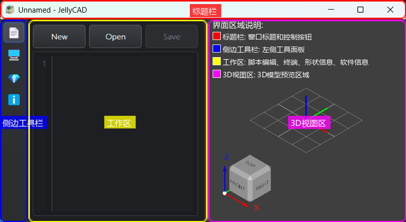

# 界面交互指南



JellyCAD 提供了直观的图形界面，方便用户进行三维模型的可视化编辑和交互操作。本指南将介绍界面的各个区域及其常用操作方法。

## 界面布局

JellyCAD 的主界面分为四个主要区域：

### 1. 标题栏（红色区域）
位于窗口顶部，显示当前文件名和程序标题。包含窗口控制按钮（最小化、最大化、关闭）。

### 2. 侧边工具栏（蓝色区域）
位于窗口左侧，提供选择工作区功能的按钮：编辑器、终端、形状信息、软件信息

### 3. 工作区（黄色区域）
位于窗口中部左侧，包含以下功能：
- **脚本编辑器** - 编写和编辑 Lua 建模脚本
- **终端窗口** - 显示脚本执行输出和错误信息
- **形状信息** - 显示选中对象的详细信息（顶点、边、面等）
- **软件信息** - 显示版本信息和系统状态

### 4. 3D视图区（紫色区域）
位于窗口右侧，用于实时显示和操作三维模型：
- **模型预览** - 显示脚本生成的三维模型
- **坐标轴指示器** - 显示当前视图的方向（X/Y/Z轴）
- **网格地面** - 提供空间参考
- **交互控制** - 支持鼠标操作进行视图变换

---

## 脚本编辑器

脚本编辑器是 JellyCAD 的核心工作区域，用于编写 Lua 建模脚本。

### 基本操作

#### 新建脚本
1. 点击顶部工具栏的 **New** 按钮
2. 或使用快捷键 `Ctrl+N`
3. 在编辑器中编写 Lua 代码

#### 打开脚本
1. 点击顶部工具栏的 **Open** 按钮
2. 或使用快捷键 `Ctrl+O`
3. 在文件对话框中选择 `.lua` 文件

#### 保存脚本
1. 点击顶部工具栏的 **Save** 按钮
2. 或使用快捷键 `Ctrl+S`
3. 首次保存时会弹出文件保存对话框

#### 运行脚本
1. 按 `F5` 键或点击运行按钮
2. 脚本执行结果会显示在3D视图区
3. 错误信息会显示在终端窗口

### 编辑功能

- **语法高亮** - Lua 代码自动语法着色
- **自动缩进** - 代码块自动缩进对齐
- **代码补全** - 输入时显示函数提示
- **行号显示** - 左侧显示代码行号
- **查找文本** - 使用 `Ctrl+F` 查找文本

### 示例代码

```lua
-- 创建一个简单的圆角立方体
b = box.new(10, 10, 10)
b:fillet(1, {})
b:color("blue")
b:show()
```

---

## 3D视图操作

3D视图区提供了丰富的交互功能，让你可以从各个角度观察和操作模型。

### 视图控制

#### 旋转视图
- **鼠标右键拖拽** - 自由旋转视图
- 旋转时可以从任意角度观察模型

#### 平移视图
- **鼠标左键** - 平移视图

#### 缩放视图
- **鼠标滚轮** - 放大或缩小视图

#### 视图快捷操作
右键点击3D视图区，弹出菜单提供以下功能：
- **Fit All** - 自适应显示所有对象
- **View Front/Back** - 切换到前视图/后视图
- **View Top/Bottom** - 切换到俯视图/仰视图
- **View Left/Right** - 切换到左视图/右视图
- **View Isometric** - 切换到等轴测视图

### 选择模式

3D视图支持多种选择模式，用于选中和操作模型的不同部分。

#### 切换选择模式
右键点击3D视图区，在弹出菜单中选择：

- **Select Shapes** - 形状选择模式（默认）
  - 选中整个形状对象
  - 用于移动、复制、删除整个模型

- **Select Faces** - 面选择模式
  - 选中形状的某个面
  - 可查看面的面积、法向量等信息
  - 用于面级别的操作和分析

- **Select Edges** - 边缘选择模式
  - 选中形状的某条边
  - 可查看边的类型、长度、起止点等信息
  - 用于圆角、倒角等边缘操作（参见[圆角和倒角操作](./fillet_chamfer.md)）

- **Select Vertices** - 顶点选择模式
  - 选中形状的某个顶点
  - 可查看顶点的精确坐标
  - 用于顶点级别的分析

#### 选择操作
- **单击** - 选中单个对象
- **Ctrl + 单击** - 多选（添加到选择集）
- **单击空白处** - 取消选择

### 形状信息查看

当选中某个形状、面、边或顶点后，工作区会显示详细信息：

**形状信息示例：**
- 类型（Solid、Face、Edge、Vertex）
- 体积（对于实体）
- 表面积
- 包围盒尺寸
- 质心位置

**边缘信息示例：**
```lua
{
  type = 'line',           -- 边缘类型
  first = {0, 0, 0},       -- 起点坐标
  last = {10, 0, 0},       -- 终点坐标
  length = 10.0,           -- 边长
  tol = 1e-6               -- 容差
}
```

**插入边缘信息到编辑器：**
1. 在边缘选择模式下选中边缘
2. 点击工作区的 **Insert edge info to editor** 按钮
3. 边缘信息会自动插入到编辑器光标位置
4. 可直接用于圆角、倒角等操作

---

## 工作区面板

工作区提供了多个功能面板，帮助你查看信息和调试脚本。

### 终端窗口

终端窗口显示脚本执行的输出信息：

**输出内容：**
- Lua 脚本的 `print()` 输出
- 函数执行结果
- 警告信息
- 错误信息和堆栈跟踪

**常见错误信息：**
```lua
-- 语法错误
[Error] unexpected symbol near '='

-- 运行时错误
[Error] attempt to call a nil value
```

### 形状信息面板

显示当前选中对象的详细几何信息：

**实体信息：**
- 体积（Volume）
- 表面积（Surface Area）
- 面数量（Number of Faces）
- 边数量（Number of Edges）
- 顶点数量（Number of Vertices）

**位置姿态：**
- 质心坐标（Center of Mass）
- 包围盒范围（Bounding Box）
- 当前位置（Position）
- 当前旋转（Rotation）

---

## 快捷键参考

### 文件操作
| 快捷键 | 功能 |
|--------|------|
| `Ctrl+N` | 新建文件 |
| `Ctrl+O` | 打开文件 |
| `Ctrl+S` | 保存文件 |
| `Ctrl+Shift+S` | 另存为 |

### 编辑操作
| 快捷键 | 功能 |
|--------|------|
| `Ctrl+Z` | 撤销 |
| `Ctrl+Y` | 重做 |
| `Ctrl+C` | 复制 |
| `Ctrl+V` | 粘贴 |
| `Ctrl+X` | 剪切 |
| `Ctrl+F` | 查找 |

### 脚本执行

打开或保存文档时执行

## 使用技巧

### 1. 快速原型开发
- 在编辑器中编写简短代码段
- 根据3D视图调整参数
- 迭代优化设计

### 2. 调试模型
- 使用 `print()` 输出中间结果
- 使用 `:show()` 分步显示模型
- 通过形状信息面板检查尺寸
- 使用选择模式检查细节

### 3. 参数化建模
```lua
-- 使用变量控制尺寸
width = 10
height = 20
depth = 5
radius = 1

box.new(width, height, depth)
   :fillet(radius, {})
   :show()
```

### 4. 批量显示
```lua
-- 一次显示多个对象
box1 = box.new(5, 5, 5):color("red")
box2 = cylinder.new(2, 8):x(10):color("blue")
box3 = sphere.new(3):x(20):color("green")

show({box1, box2, box3})
```

### 5. 使用注释
```lua
-- 良好的注释习惯
-- 创建基座
base = cylinder.new(50, 35)

-- 创建孔洞
hole = cylinder.new(10, 40):z(-5)

-- 布尔运算
result = base:cut(hole)
result:show()
```

---

## 常见问题

### Q: 模型显示不完整或看不见？
**A:** 尝试以下方法：
1. 右键点击3D视图，选择 **Fit All**
2. 检查脚本是否调用了 `:show()` 方法
3. 检查对象的位置是否超出视野范围
4. 检查透明度设置是否过高

### Q: 脚本执行报错如何处理？
**A:** 查看终端窗口的错误信息：
1. 检查语法错误（如缺少括号、逗号等）
2. 检查函数名和参数是否正确
3. 检查变量是否已定义
4. 参考 [脚本函数文档](./functions.md)

### Q: 如何导出高质量的STL文件？
**A:** 使用 `export_stl()` 并设置合适的参数：
```lua
export_stl("model.stl", {
    type = "binary",
    radian = 0.01  -- 越小越精细
})
```

### Q: 选择的边缘信息不准确？
**A:** 调整容差参数：
```lua
-- 增大 tol 值以提高匹配率
edge_info = {
    type = 'line',
    first = {0, 0, 0},
    last = {10, 0, 0},
    tol = 1e-2  -- 从默认的 1e-6 增大到 1e-2
}
```

---

## 相关参考

- [安装指南](./install.md)
- [脚本函数参考](./functions.md)
- [圆角和倒角操作](./fillet_chamfer.md)
- [机器人开发指南](./robot_develop.md)